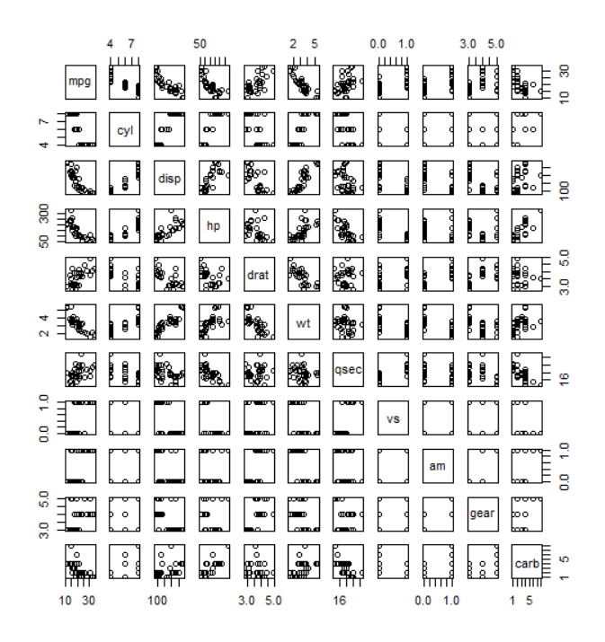

# 00_9_그래프와 수치요약

[TOC]

그래프는 r 내장 데이터인 mtcars를 사용하여 연습

```
data(mtcars)
```

<br>

## plot()

양적 변수들의 산점도

```r
plot(mpg$cyl, mpg$hwy)
```


## hist()

히스토그램

```r
hist(mpg$cyl)
```


## pairs()

산점도 행렬: 주어진 자료의 모든 변수쌍에 대한 산점도

```r
pairs(mtcars)
pairs(~ mpg + disp + hp + wt + qsec, mtcars)
```




## identify()

그래프 상의 점에 대한 특정 변수값을 대화형으로 식별

x축변수, y축변수, 값이 출력되길 원하는 변수 제공 -> 주어진 점을 클릭하면 관심있는 변수의 값 출력

```r
identify(mtcars$hp, mtcars$mpg, mtcars$carb)
# [1]  1  5  6  7 11 15 16 24 29 30 31 32
```


## summary()

특정 자료 내 각 변수에 대한 요약 제공

- 질적변수: 각 카테고리에 속하는 관측치의 수 열거
- 하나의 변수에 대한 요약 확인 가능

```r
summary(mtcars)

      mpg             cyl             disp             hp       
 Min.   :10.40   Min.   :4.000   Min.   : 71.1   Min.   : 52.0  
 1st Qu.:15.43   1st Qu.:4.000   1st Qu.:120.8   1st Qu.: 96.5  
 Median :19.20   Median :6.000   Median :196.3   Median :123.0  
 Mean   :20.09   Mean   :6.188   Mean   :230.7   Mean   :146.7  
 3rd Qu.:22.80   3rd Qu.:8.000   3rd Qu.:326.0   3rd Qu.:180.0  
 Max.   :33.90   Max.   :8.000   Max.   :472.0   Max.   :335.0  
      drat             wt             qsec             vs        
 Min.   :2.760   Min.   :1.513   Min.   :14.50   Min.   :0.0000  
 1st Qu.:3.080   1st Qu.:2.581   1st Qu.:16.89   1st Qu.:0.0000  
 Median :3.695   Median :3.325   Median :17.71   Median :0.0000  
 Mean   :3.597   Mean   :3.217   Mean   :17.85   Mean   :0.4375  
 3rd Qu.:3.920   3rd Qu.:3.610   3rd Qu.:18.90   3rd Qu.:1.0000  
 Max.   :4.930   Max.   :5.424   Max.   :22.90   Max.   :1.0000  
       am              gear            carb      
 Min.   :0.0000   Min.   :3.000   Min.   :1.000  
 1st Qu.:0.0000   1st Qu.:3.000   1st Qu.:2.000  
 Median :0.0000   Median :4.000   Median :2.000  
 Mean   :0.4062   Mean   :3.688   Mean   :2.812  
 3rd Qu.:1.0000   3rd Qu.:4.000   3rd Qu.:4.000  
 Max.   :1.0000   Max.   :5.000   Max.   :8.000
```

```r
summary(mtcars$mpg)

   Min. 1st Qu.  Median    Mean 3rd Qu.    Max. 
  10.40   15.43   19.20   20.09   22.80   33.90 
```


