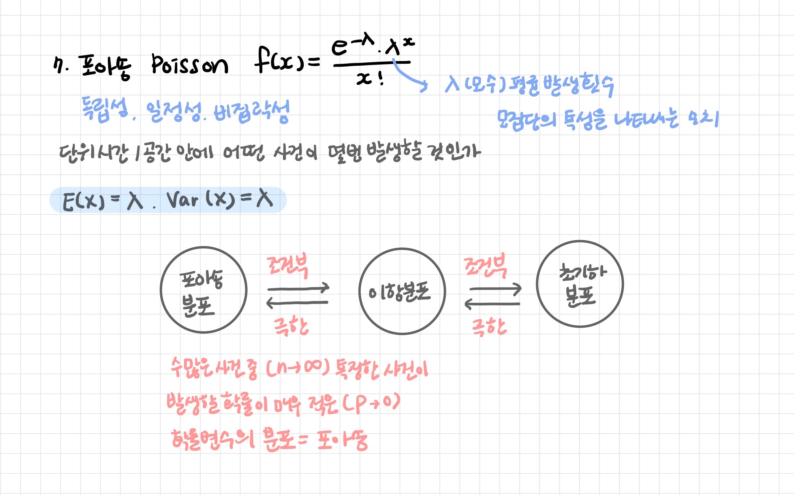
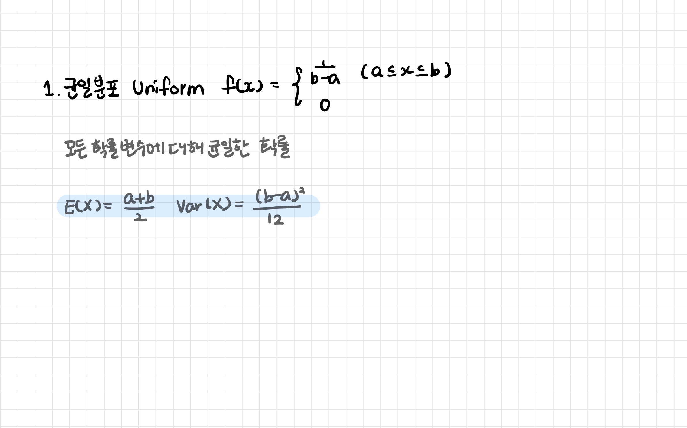
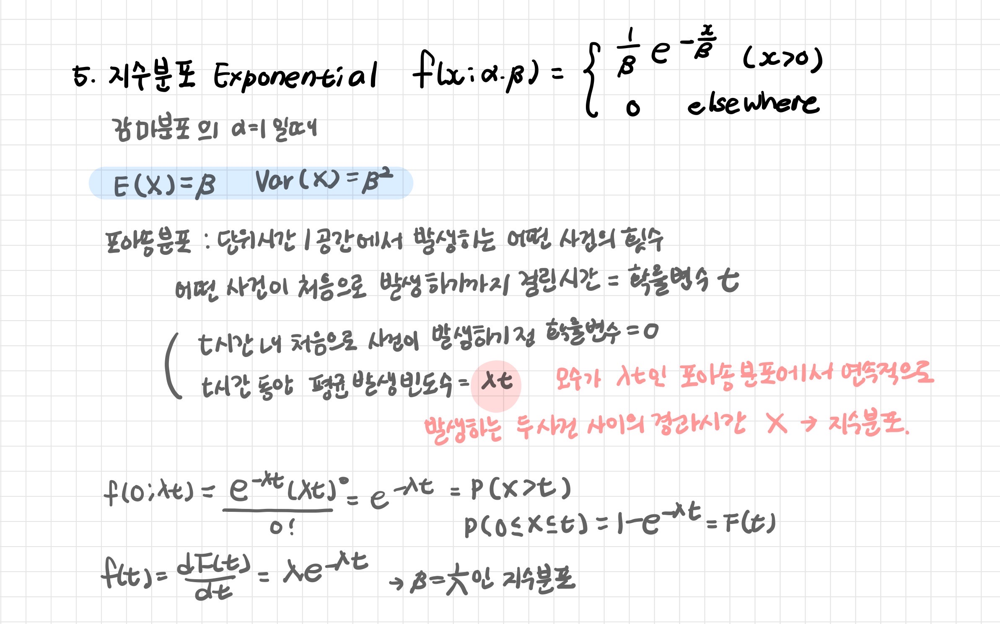

# 1_분포 함수 및 통계량

> 확률분포: 확률변수가 특정한 값을 가질 확률을 나타내는 함수
>
> - 분포함수: 확률 변수의 누적 분포를 기술하는 함수 `F(x) = 확률변수 X가 x이하의 값을 가질 확률)`
> - 확률질량함수: 이산형 데이터의 확률
> - 확률밀도함수: 연속형 데이터의 확률

[TOC]

## 0. 기초 통계량


**표본 평균**

```r
> mean(iris$Sepal.Length)
[1] 5.843333
```

**표본 분산**

```r
> var(iris$Sepal.Length)
[1] 0.6856935
```

**표본 표준 편차**

```r
> sd(iris$Sepal.Length)
[1] 0.8280661
```

**다섯 수치 요약**

최소값, 제1사분위수, 중앙값, 제3사분위수, 최댓값

```r
> fivenum(iris$Sepal.Length)
[1] 4.3 5.1 5.8 6.4 7.9
```

```r
> summary(iris$Sepal.Length)
   Min. 1st Qu.  Median    Mean 3rd Qu.    Max. 
  4.300   5.100   5.800   5.843   6.400   7.900 
```

**최빈값**

```r
> table(iris$Sepal.Length)

4.3 4.4 4.5 4.6 4.7 4.8 4.9   5 5.1 5.2 5.3 5.4 5.5 5.6 5.7 5.8 5.9   6 6.1 
  1   3   1   4   2   5   6  10   9   4   1   6   7   6   8   7   3   6   6 
6.2 6.3 6.4 6.5 6.6 6.7 6.8 6.9   7 7.1 7.2 7.3 7.4 7.6 7.7 7.9 
  4   9   7   5   2   8   3   4   1   1   3   1   1   1   4   1 
```

```r
> which.max(table(iris$Sepal.Length))
5 
8
```


<br>

<br>

---

<br>

## 1. 이산확률분포

> Discrete Probability Distribution

- 이산확률변수가 가지는 확률 분포

- 확률질량함수(pmf)로 표현

<br>

### 1-1. 베르누이 분포

### 1-2. 이항분포

### 1-3. 다항분포


### 1-4. 초기하분포


### 1-5. 기하분포

### 1-6. 음이항분포


### 1-7. 포아송분포



<br>

<br>

---

<br>

## 2. 연속확률분포

> Continuous Probability Distribution

- 연속확률변수가 가지는 확률 분포

- 확률밀도함수(pdf)로 표현

<br>

### 2-1. 균일분포



### 2-2. 정규분포


### 2-3. 표준정규분포

### 2-4. 감마분포


### 2-5. 지수분포



### 2-6. 베타분포


