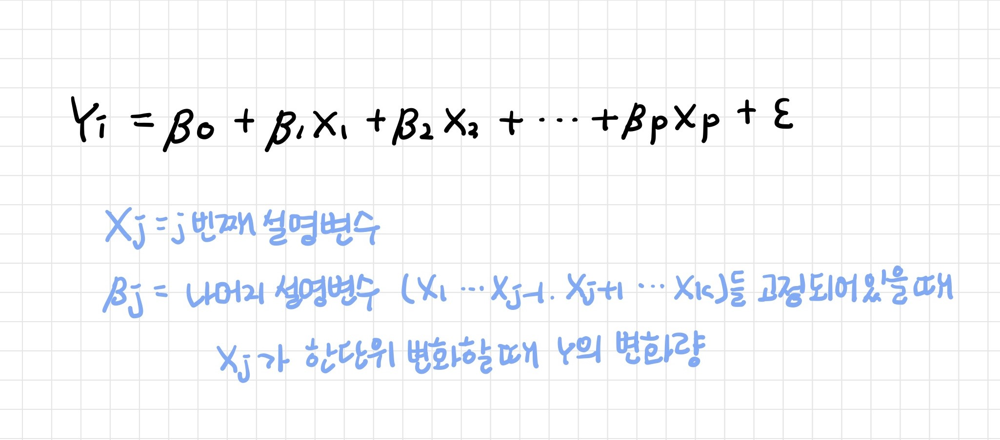
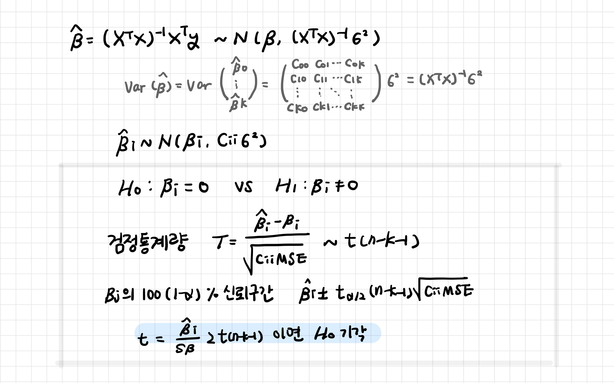
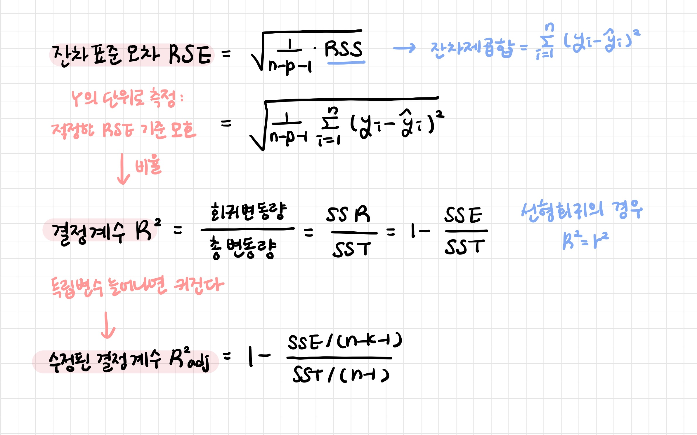

# 2_다중 선형 회귀

> Multiple Linear Regression

종속변수를 두 개 이상의 독립변수로 설명

[TOC]



<br>

---

<br>

## 1. 모델 생성

### 1-1. 계수 추정

**최소제곱추정법 (LSE; Least Square Estimation Method)**

오차의 제곱 합이 최소가 되도록 회귀 계수를 추정하는 방법


<br>

### 1-2. 선형 회귀 결과

> 모든 설명변수의 p-value < 0.05 이므로 H0 기각 -> 유의미한 설명변수라고 볼 수 있다
>
> F 통계량의 p-value = 2.2e-16 < 0.05 H0 기각 -> 하나 이상의 설명 변수의 계수가 0이 아니라고 볼 수 있다

```r
> m <- lm(Sepal.Length ~ Sepal.Width + Petal.Length + Petal.Width, data=iris)

> summary(m)

Call:
lm(formula = Sepal.Length ~ Sepal.Width + Petal.Length + Petal.Width, 
    data = iris)

Residuals:
     Min       1Q   Median       3Q      Max 
-0.82816 -0.21989  0.01875  0.19709  0.84570 

Coefficients:
             Estimate Std. Error t value Pr(>|t|)    
(Intercept)   1.85600    0.25078   7.401 9.85e-12 ***
Sepal.Width   0.65084    0.06665   9.765  < 2e-16 ***
Petal.Length  0.70913    0.05672  12.502  < 2e-16 ***
Petal.Width  -0.55648    0.12755  -4.363 2.41e-05 ***
---
Signif. codes:  
0 ‘***’ 0.001 ‘**’ 0.01 ‘*’ 0.05 ‘.’ 0.1 ‘ ’ 1

Residual standard error: 0.3145 on 146 degrees of freedom
Multiple R-squared:  0.8586,	Adjusted R-squared:  0.8557 
F-statistic: 295.5 on 3 and 146 DF,  p-value: < 2.2e-16
```

<br>

```r
# Species별로 산점도 
> with(iris, plot(Sepal.Width, Sepal.Length, cex=.7, pch=as.numeric(Species)))

# 회귀직선
> m <- lm(Sepal.Length ~ Sepal.Width + Species, data=iris)
> coef(m)
      (Intercept)       Sepal.Width Speciesversicolor 
        2.2513932         0.8035609         1.4587431 
 Speciesvirginica 
        1.9468166 

> abline(2.25, 0.80, lty=1)
> abline(2.25 + 1.45, 0.80, lty=2)
> abline(2.25 + 1.94, 0.80, lty=3)

# 범례 표시
> legend("topright", levels(iris$Species), pch=1:3, bg="white")

# 범주형 변수의 각 레벨 이름
> levels(iris$Species)
[1] "setosa"     "versicolor" "virginica" 
```


<br>

---

<br>

## 2. 제곱합 분해 

### 2-1. 제곱합 분해

> Decomposition

- **SST (Total Sum of Square)**: 총 제곱합
- **SSR (Regression Sum of Square)**: 회귀 제곱합
- **SSE (Error Sum of Square)**: 오차 제곱합


<br>

### 2-2. 분산분석표 (ANOVA)

| 변동요인 | 제곱합 (SS) | 자유도 | 평균제곱 (MS)       | 검정 통계량   |
| -------- | ----------- | ------ | ------------------- | ------------- |
| **회귀** | SSR         | k      | MSR = SSR / k       | F = MSR / MSE |
| **잔차** | SSE         | n-k-1  | MSE = SSE / (n-k-1) |               |
| **합계** | SST         | n-1    |                     |               |

<br>

---

<br>

## 3. 회귀모형 검정

### 3-1. 회귀식의 유의성 검정

반응변수와 설명변수 사이에 상관관계가 있는지


<br>

### 3-2. 개별 계수의 유의성 검정



<br>

---

<br>

## 4. 회귀모형 평가

귀무가설을 기각하고 대립가설을 채택했다면 모델이 데이터에 적합한 정도를 평가해야한다



<br>

---

<br>

## 5. 예측

### 5-1. 평균값 예측과 신뢰구간


<br>

### 5-2. 개별값 예측과 예측구간


