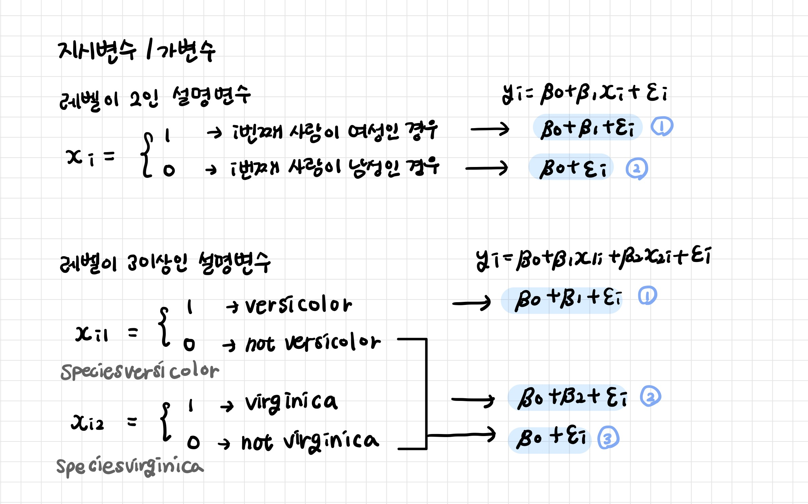

# 3_질적설명변수

질적자료를 갖는 질적변수

<br>

**가변수(Dummy Variable)**: 질적 변수를 통계분석을 위해여 0과 1로 지정한 변수



<br>

> 범주형 변수 Species를 2개의 가변수를 사용하여 표현
>
> Species 별로 세 가지 모델을 만든 것과 같다

| Species    | Speciesversicolor | Speciesvirginica |
| ---------- | ----------------- | ---------------- |
| setosa     | 0                 | 0                |
| versicolor | 1                 | 0                |
| virginica  | 0                 | 1                |

```r
> m <- lm(Sepal.Length ~ ., data=iris)
> summary(m)

Call:
lm(formula = Sepal.Length ~ ., data = iris)

Residuals:
     Min       1Q   Median       3Q      Max 
-0.79424 -0.21874  0.00899  0.20255  0.73103 

Coefficients:
                  Estimate Std. Error t value
(Intercept)        2.17127    0.27979   7.760
Sepal.Width        0.49589    0.08607   5.761
Petal.Length       0.82924    0.06853  12.101
Petal.Width       -0.31516    0.15120  -2.084
Speciesversicolor -0.72356    0.24017  -3.013
Speciesvirginica  -1.02350    0.33373  -3.067
                  Pr(>|t|)    
(Intercept)       1.43e-12 ***
Sepal.Width       4.87e-08 ***
Petal.Length       < 2e-16 ***
Petal.Width        0.03889 *  
Speciesversicolor  0.00306 ** 
Speciesvirginica   0.00258 ** 
---
Signif. codes:  
0 ‘***’ 0.001 ‘**’ 0.01 ‘*’ 0.05 ‘.’ 0.1 ‘ ’ 1

Residual standard error: 0.3068 on 144 degrees of freedom
Multiple R-squared:  0.8673,	Adjusted R-squared:  0.8627 
F-statistic: 188.3 on 5 and 144 DF,  p-value: < 2.2e-16
```

> 1행은 setosa, 51행은 versicolor, 101행은 virginica 종에 대한 데이터

```r
> model.matrix(m)[c(1, 51, 101),]
    (Intercept) Sepal.Width Petal.Length Petal.Width
1             1         3.5          1.4         0.2
51            1         3.2          4.7         1.4
101           1         3.3          6.0         2.5
    Speciesversicolor Speciesvirginica
1                   0                0
51                  1                0
101                 0                1
```

> anova 테이블에서는 Species가 하나의 설명변수로 묶여서 표시
>
> p-value = 0.0103288 < 0.05 이므로 H0 기각 -> 유의미한 설명변수라고 볼 수 있다

```r
> anova(m)
Analysis of Variance Table

Response: Sepal.Length
              Df Sum Sq Mean Sq  F value    Pr(>F)
Sepal.Width    1  1.412   1.412  15.0011 0.0001625
Petal.Length   1 84.427  84.427 896.8059 < 2.2e-16
Petal.Width    1  1.883   1.883  20.0055 1.556e-05
Species        2  0.889   0.444   4.7212 0.0103288
Residuals    144 13.556   0.094                   
                
Sepal.Width  ***
Petal.Length ***
Petal.Width  ***
Species      *  
Residuals       
---
Signif. codes:  
0 ‘***’ 0.001 ‘**’ 0.01 ‘*’ 0.05 ‘.’ 0.1 ‘ ’ 1
```


