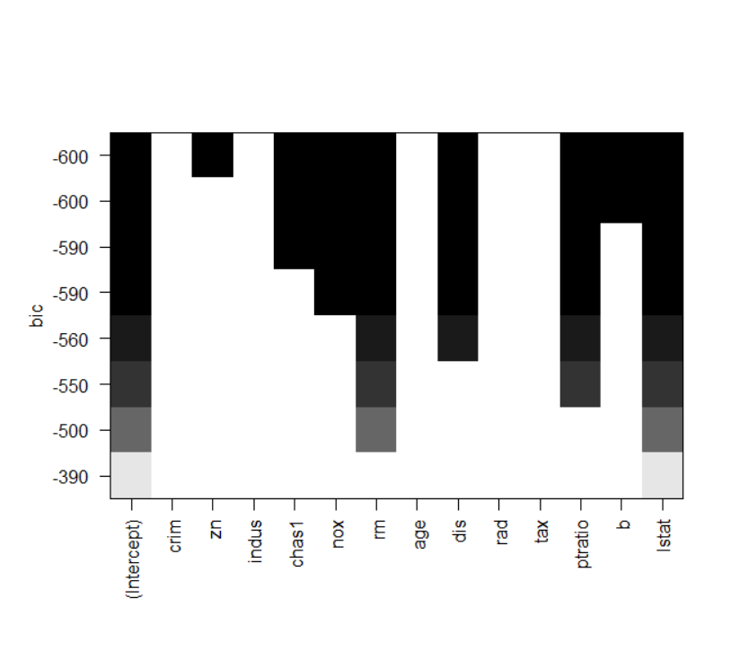

# 7_적합대안 - 변수선택

[TOC]

선형 회귀 모델 구축에 사용되는 최소제곱법이 아닌 다른 적합절차를 사용하는 이유

- 예측 정확도: n이 p보다 아주 크지 않으면 최소제곱적합에 많은 변동이 존재할 수 있어 과적합을 초래할 수 있다. p>n가 되면 분산이 무한대가 되어 최소제곱 방법은 전혀 사용할 수 없게 된다.
- 모델 해석력: 최소제곱방법으로 반응변수와 관련이 없는 변수들도 정확하게 0인 계수 추정치를 얻게 될 가능성은 거의 없다. 관련없는 변수들을 제외하는 기법들이 필요하다.

→ 서브셋(부분집합) 선택, 수축(shrinkage), 차원축소(Dimension Reduction)

<br>

**변수선택**: 선형 회귀 모델을 만들 때 주어진 여러 변수 중 어떤 변수를 설명 변수로 해야 할지 선택하는 과정으로 F 통계량이나 AIC 를 사용해 변수를 하나씩 택하거나 제거하는 것

<br>

---

<br>

## 1. 최상의 부분집합 선택법

p개 설명변수의 모든 가능한 조합 각각에 대해 최소제곱회귀 적합 (2^p)

각 부분집합 크기에서 최고의 모델 (훈련데이터에 대해)을 식별하여 (p+1) 개의 모델 중에 하나 선택 

```
1. M0: null model
2. k = 1, 2, ..., p에 대해 k개의 설명변수를 포함하는 모든 pCk개의 모델 적합
3. pCk개의 모델 중 최고의 모델을 골라 Mk
4. M0, ..., Mk 중 최고의 모델 하나 선택
```

> 변수를 하나만 표함하겠다면 lstat를 포함한 모델이 가장 좋다

```r
> install.packages("leaps")
> library(leaps)

> m <- regsubsets(medv ~ ., data=BostonHousing)
> summary(m)

Subset selection object
Call: regsubsets.formula(medv ~ ., data = BostonHousing)
13 Variables  (and intercept)
        Forced in Forced out
crim        FALSE      FALSE
zn          FALSE      FALSE
indus       FALSE      FALSE
chas1       FALSE      FALSE
nox         FALSE      FALSE
rm          FALSE      FALSE
age         FALSE      FALSE
dis         FALSE      FALSE
rad         FALSE      FALSE
tax         FALSE      FALSE
ptratio     FALSE      FALSE
b           FALSE      FALSE
lstat       FALSE      FALSE
1 subsets of each size up to 8
Selection Algorithm: exhaustive
         crim zn  indus chas1 nox rm  age dis
1  ( 1 ) " "  " " " "   " "   " " " " " " " "
2  ( 1 ) " "  " " " "   " "   " " "*" " " " "
3  ( 1 ) " "  " " " "   " "   " " "*" " " " "
4  ( 1 ) " "  " " " "   " "   " " "*" " " "*"
5  ( 1 ) " "  " " " "   " "   "*" "*" " " "*"
6  ( 1 ) " "  " " " "   "*"   "*" "*" " " "*"
7  ( 1 ) " "  " " " "   "*"   "*" "*" " " "*"
8  ( 1 ) " "  "*" " "   "*"   "*" "*" " " "*"
         rad tax ptratio b   lstat
1  ( 1 ) " " " " " "     " " "*"  
2  ( 1 ) " " " " " "     " " "*"  
3  ( 1 ) " " " " "*"     " " "*"  
4  ( 1 ) " " " " "*"     " " "*"  
5  ( 1 ) " " " " "*"     " " "*"  
6  ( 1 ) " " " " "*"     " " "*"  
7  ( 1 ) " " " " "*"     "*" "*"  
8  ( 1 ) " " " " "*"     "*" "*" 
```

> BIC, 수정 결정계수 등의 값 확인

```r
> summary(m)$bic
[1] -385.0521 -496.2582 -549.4767 -561.9884 -585.6823
[6] -592.9553 -598.2295 -600.1663

> summary(m)$adjr2
[1] 0.5432418 0.6371245 0.6767036 0.6878351 0.7051702
[6] 0.7123567 0.7182560 0.7222072
```

```r
> plot(m, scale="adjr2")
```




<br>

---

<br>

## 2. 전진 선택법

> forawrd selection

- 더 이상 유의한 추가 변수가 없을 때까지 변수를 하나씩 추가
- 절편만 있는 모델에서 기준 통계치를 가장 많이 개선시키는 변수를 차례로 추가
- n < p인 경우에도 사용 가능

```
1. M0: null model
2. k = 1, 2, ..., p-1에 대해 Mk개에 하나의 설명변수를 추가한 모든 p-k개의 모델 고려
3. p-k개의 모델 중에서 최고를 골라 MK+1
4. M0, ..., Mp 중 최고의 모델 하나 선택
```

```
1. 고려된 변수 중 SSR(Xi)이 가장 높고 유의하면 변수를 선택한다
2. 이미 선택된 설명변수(Xi)의 설명부분 SSR을 제외한 SSR의 증가분 SSR(Xj|Xi)이 가장 크고 설명력이 유의한 경우 Xj 선택
3. 이미 선택된 설명변수(xi, Xj)의 설명부분 SSR을 제외한 SSR의 증가분 SSR(Xl|Xi, Xj)이 가장 크고 설명력이 유의한 경우 Xl 선택
4. 유의한 설명변수가 없을 때까지 반복
```

계산 시간이 빠르지만 선택된 설명변수는 절대 제거되지 않고 중요한 변수가 모형에 진입하지 못할 수도 있다

유의성 검정 과정 첨부

<br>

---

<br>

## 3. 후진 제거법

> Backward Elimination

- 유의하지 않은 독립변수들을 계속 제거
- 모든 변수가 포함된 모델에서 기준 통계치에 가장 도움이 되지 않는 변수를 하나씩 제거
- 표본의 수 n > 설명변수의 수 p (완전모델 적합이 가능해야한다)

```
1. M0: null model
2. k = p, p-1, ..., 1에 대해 Mk개에 하나의 설명변수를 제외한 모든 k개의 모델 고려
3. k개의 모델 중에서 최고를 골라 Mk-1
4. M0, ..., Mp 중 최고의 모델 하나 선택
```

```
1. 고려된 설명변수를 모두 삽입한 후 설명변수 중 가장 유의하지 않은 설명변수를 제거
2. 모든 설명변수가 유의할 때까지 반복
```

<br>

---

<br>

## 4. 단계적 선택

> Stepwise Selection

- 전진 선택법 + 후진 제거법

- 모든 변수가 포함된 모델 / 절편만 포함된 모델에서 출발
- 기준 통계치에 가장 도움이 되지 않는 변수를 삭제 / 빠져 있는 변수 중에서 기준 통계치를 가장 개선시키는 변수 추가

```
1. 고려된 설명 변수 중 설명력 SSR(Xi)이 가장 높고 설명력이 유의하면 변수 선택
2. 이미 선택된 설명변수의 설명부분을 제외한 SSR(Xj|Xi)이 가장 크고 설명력이 유의한 경우 Xj를 선택
3. 새로 선택된 변수의 설명부분을 제외한 부분에 대해 이미 존재한 설명변수의 유의성을 검정하여 유의하지 않으면 제외 / 유의하면 계속 넣고 다음 단계
4. 다시 이미 선택된 변수를 제외하고 다른 변수들 중 가장 SSR의 증가분이 높은 변수를 유의성 검정에 의해 유의하면 변수 추가
5. 유의한 설명변수가 존재하지 않을 때까지 반복
```

중요한 변수가 모형에서 제외될 가능성이 적은 비교적 안전한 방법이지만 한 번 제외된 변수는 다시 선택되지 못한다

<br>

---

<br>

> 보스턴의 집 가격 medv를 종속변수, 범죄율, 방의 수 등의 모든 변수를 독립변수 -> 변수의 추가 삭제를 반복하면서 최적의 모델 찾기
>
> step1: 13개의 변수 사용하고 AIC=1589.64
>
> 각 변수를 삭제했을 때 AIC의 변화 -> AIC를 가장 작게 만드는 변수를 삭제

```r
> install.packages("mlbench")
> library(mlbench)
> data("BostonHousing")

> m <- lm(medv ~ ., data=BostonHousing)
> m2 <- step(m, direction="both")

Start:  AIC=1589.64
medv ~ crim + zn + indus + chas + nox + rm + age + dis + rad + 
    tax + ptratio + b + lstat

          Df Sum of Sq   RSS    AIC
- age      1      0.06 11079 1587.7
- indus    1      2.52 11081 1587.8
<none>                 11079 1589.6
- chas     1    218.97 11298 1597.5
- tax      1    242.26 11321 1598.6
- crim     1    243.22 11322 1598.6
- zn       1    257.49 11336 1599.3
- b        1    270.63 11349 1599.8
- rad      1    479.15 11558 1609.1
- nox      1    487.16 11566 1609.4
- ptratio  1   1194.23 12273 1639.4
- dis      1   1232.41 12311 1641.0
- rm       1   1871.32 12950 1666.6
- lstat    1   2410.84 13490 1687.3
```

>step2: 12개의 변수 사용하고 AIC=1587.65
>
>각 변수를 삭제 / 추가했을 때 AIC의 변화 -> AIC를 가장 작게 만드는 변수를 삭제 / 추가

```r
Step:  AIC=1587.65
medv ~ crim + zn + indus + chas + nox + rm + dis + rad + tax + 
    ptratio + b + lstat

          Df Sum of Sq   RSS    AIC
- indus    1      2.52 11081 1585.8
<none>                 11079 1587.7
+ age      1      0.06 11079 1589.6
- chas     1    219.91 11299 1595.6
- tax      1    242.24 11321 1596.6
- crim     1    243.20 11322 1596.6
- zn       1    260.32 11339 1597.4
- b        1    272.26 11351 1597.9
- rad      1    481.09 11560 1607.2
- nox      1    520.87 11600 1608.9
- ptratio  1   1200.23 12279 1637.7
- dis      1   1352.26 12431 1643.9
- rm       1   1959.55 13038 1668.0
- lstat    1   2718.88 13798 1696.7
```

```r
Step:  AIC=1585.76
medv ~ crim + zn + chas + nox + rm + dis + rad + tax + ptratio + 
    b + lstat

          Df Sum of Sq   RSS    AIC
<none>                 11081 1585.8
+ indus    1      2.52 11079 1587.7
+ age      1      0.06 11081 1587.8
- chas     1    227.21 11309 1594.0
- crim     1    245.37 11327 1594.8
- zn       1    257.82 11339 1595.4
- b        1    270.82 11352 1596.0
- tax      1    273.62 11355 1596.1
- rad      1    500.92 11582 1606.1
- nox      1    541.91 11623 1607.9
- ptratio  1   1206.45 12288 1636.0
- dis      1   1448.94 12530 1645.9
- rm       1   1963.66 13045 1666.3
- lstat    1   2723.48 13805 1695.0
```

<br>

---

<br>

## 5. 최량부분집합

> Best Subsets Regression

변수의 수가 1, 2, ..., k개 일 때, 각각 최고의 모형을 찾고 수정된 R2를 비교해서 최선의 모형을 선택

- 절약모형 (parsimonious model): 변수의 수를 고려한 비교에 의해 간단한 모형을 찾는다

- 변수의 수가 많으면 계산량이 매우 많아진다


