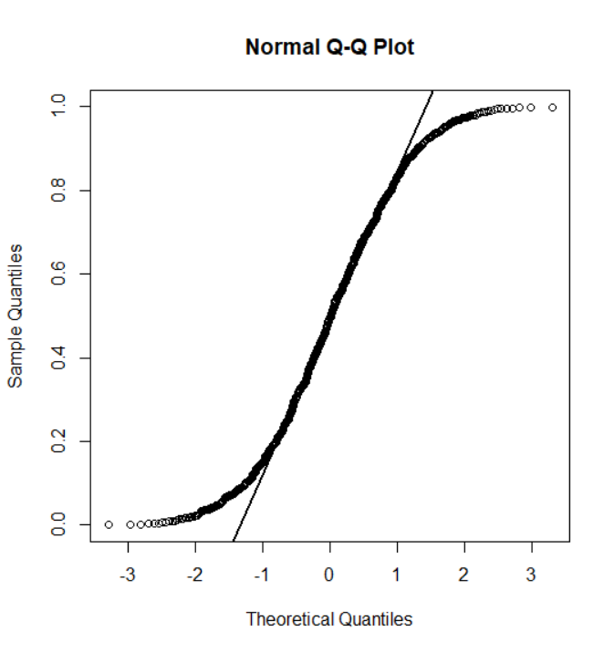
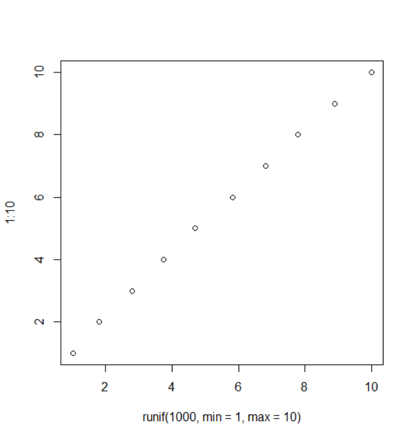

# 1_적합도 검정

데이터가 특정 분포를 따른다고 가정했을 때 실제로 그 분포를 따르는지 확인

[TOC]

## 1. 카이제곱 검정

- 분할표를 만들고 카이제곱 검정

- 독립성 검정과는 달리 평균을 비교하고자 하는 분포로부터 계산

> `H0: 왼손잡이와 오른손잡이의 비율이 3:7이다`
>
> p-value = 6.376e-14 < 0.05 이므로 귀무가설 기각: 왼손잡이와 오른손잡이의 비율은 3:7이라고 할 수 없다.

```r
> table(survey$W.Hnd)

 Left Right 
   18   218 

> chisq.test(table(survey$W.Hnd), p=c(.3, .7))

	Chi-squared test for given probabilities

data:  table(survey$W.Hnd)
X-squared = 56.252, df = 1, p-value = 6.376e-14
```

<br>

---

<br>

## 2. 샤피로 윌크 검정

> Shapiro-Wilk Test

- 표본이 정규 분포로부터 추출된 것인지 확인하기 위한 방법

- 귀무가설: 주어진 데이터가 정규분포로부터의 표본이다

> H0: 주어진 데이터가 정규분포를 따른다
>
> p-value = 0.1776 > 0.05 이므로 귀무가설 기각 X : 주어진 데이터가 정규분포를 따른다고 할 수 있다.

```r
> shapiro.test(rnorm(1000))

	Shapiro-Wilk normality test

data:  rnorm(1000)
W = 0.9977, p-value = 0.1776
```

<br>

---

<br>

## 3. 콜모고로프 스미르노프 검정

> Kolmogorov-Smirnov Test; K-S test

- 두 데이터의 분포가 동일한지 확인

- 데이터의 누적 분포 함수와 비교하고자 하는 분포의 누적 분포 함수 간의 최대 거리를 통계량으로 사용

> H0: 정규분포를 따르는 두 난수 데이터 간의 분포가 동일하다
>
> p-value = 0.1545 > 0.05 이므로 귀무가설 기각 x : 동일하다고 볼 수 있다.

```r
> ks.test(rnorm(100), rnorm(100))

	Two-sample Kolmogorov-Smirnov test

data:  rnorm(100) and rnorm(100)
D = 0.16, p-value = 0.1545
alternative hypothesis: two-sided
```

<br>

> H0: 데이터가 평균0, 분산1인 정규분포로부터 뽑은 표본이다.
>
> p-value = 0.09218 > 0.05 이므로 귀무가설 기각 x : 평균0, 분산1인 정규분포를 다른다고 볼 수 있다.

```r
> ks.test(rnorm(100), "pnorm", 0, 1)

	One-sample Kolmogorov-Smirnov test

data:  rnorm(100)
D = 0.12404, p-value = 0.09218
alternative hypothesis: two-sided
```

<br>

---

<br>

## 4. Q-Q plot

- 비교하고자 하는 분포의 분위수끼리 좌표 평면에 표시하여 그린 그림

- 데이터의 분위수와 비교하고자 하는 분포의 분위수 간에 직선 관계가 보이는지 확인

<br>

### 4-1. 정규성을 따르는지 확인

- (X, Z)를 그려서 직선관계를 확인

```r
> x <- rnorm(1000, mean=10, sd=1)
> qqnorm(x)
> qqline(x, lty=2)
```


```r
> x <- runif(1000)
> qqnorm(x)
> qqline(x, lwd=2)
```



<br>

### 4-2. 기타 분포를 따르는지 확인

`qqplot(확인하고자 하는 데이터, 분포)`

```r
qqplot(runif(1000, min=1, max=10), 1:10)
```


