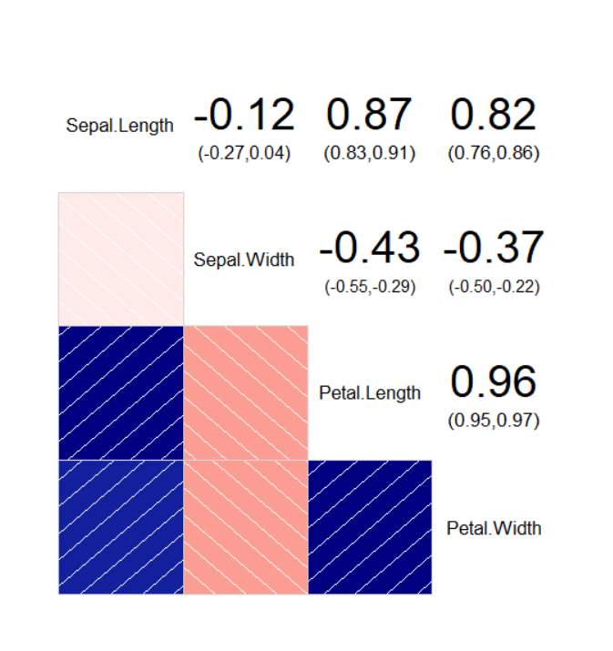

## 1_상관 분석

> Correlation Analysis

[TOC]

**상관분석 (Correlation Analysis)**: 두 확률 변수 사이의 관련성을 파악하는 방법

**상관계수 (Correlation Coefficient)**: 두 변수 간 관련성의 정도

- 상관 계수 값이 크면 데이터 간의 관계가 존재한다는 의미
- 상관계수와 인과 관계와의 관계: 인과관계를 의미하지는 않는다
- 상관계수와 독립과의 관계: 독립이면 상관계수 = 0 (O) / 상관계수 = 0이면 독립 (X)


<br>

---

<br>

## 1. 피어슨 상관계수

> Pearson Correlation Coefficient

두 변수 간의 선형적 상관관계 측정

- 선형 관계의 연관성 파악
- 연속형 데이터에 적합

| ρ(X, Y) > 0                                  | ρ(X, Y) < 0                                  | ρ(X, Y) = 1                                   |
| -------------------------------------------- | -------------------------------------------- | --------------------------------------------- |
| 한 변수가 커지면 다른 변수도 선형적으로 증가 | 한 변수가 커지면 다른 변수는 선형적으로 감소 | (X, Y)를 좌표 평면에 그리면 직선으로 나타난다 |

- `cor`: 상관계수 구하기
- `symnum`: 숫자를 심볼로 표현하기
- `corrgram::corrgram`: 상관계수 행렬을 그림으로 보여주기 
  - `upper.panel=panel.conf)`: 상관계수를 우측 상단에 표시한다는 의미
  - 좌측하단으로 빗금: 양의 상관계수
  - 우측하단으로 빗금: 음의 상관계수
  - 색의 짙기: 상관계수의 크기 (절댓값)

<br>

> iris 데이터에서 Sepal.Width와 Sepal.Length의 피어슨 상관 계수 구하기
>
> Sepal.Width와 Sepal.Length는 음의 상관관계가 있다

```r
> cor(iris$Sepal.Width, iris$Sepal.Length)
[1] -0.1175698
```

```r
> cor(iris[,1:4])
             Sepal.Length Sepal.Width Petal.Length Petal.Width
Sepal.Length    1.0000000  -0.1175698    0.8717538   0.8179411
Sepal.Width    -0.1175698   1.0000000   -0.4284401  -0.3661259
Petal.Length    0.8717538  -0.4284401    1.0000000   0.9628654
Petal.Width     0.8179411  -0.3661259    0.9628654   1.0000000
```

```r
> symnum(cor(iris[,1:4]))
             S.L S.W P.L P.W
Sepal.Length 1              
Sepal.Width      1          
Petal.Length +   .   1      
Petal.Width  +   .   B   1  
attr(,"legend")
[1] 0 ‘ ’ 0.3 ‘.’ 0.6 ‘,’ 0.8 ‘+’ 0.9 ‘*’ 0.95 ‘B’ 1
```

```r
> install.packages("corrgram")
> library(corrgram)
> corrgram(iris, upper.panel=panel.conf)
```



<br>

---

<br>

## 2. 스피어만 상관계수

> Spearman's Rank Correlation Coefficient

상관계수를 계산할 두 데이터의 실제 값 대신 두 값의 순위를 사용해 상관계수를 계산하는 방법

- 비선형 관계의 연관성 파악 가능
- 데이터에 순위만 매길 수 있다면 가능: 이산형 데이터, 순서형 데이터 적용 가능

| 1                                                  | -1                                           | 0                                             |
| -------------------------------------------------- | -------------------------------------------- | --------------------------------------------- |
| 한 쪽의 순위가 증감함에 따라 다른 쪽의 순위도 증가 | 한 변수가 커지면 다른 변수는 선형적으로 감소 | (X, Y)를 좌표 평면에 그리면 직선으로 나타난다 |

<br>

> 스피어만 상관계수는 1로 계산되지만 피어슨 상관 계수는선형 관계를 따지게 되어  1보다 작게 나타난다

```r
> m <- matrix(c(1:10, (1:10)^2), ncol=2)
> m
      [,1] [,2]
 [1,]    1    1
 [2,]    2    4
 [3,]    3    9
 [4,]    4   16
 [5,]    5   25
 [6,]    6   36
 [7,]    7   49
 [8,]    8   64
 [9,]    9   81
[10,]   10  100

> cor(m, method="spearman")
     [,1] [,2]
[1,]    1    1
[2,]    1    1

> cor(m, method="pearson")
          [,1]      [,2]
[1,] 1.0000000 0.9745586
[2,] 0.9745586 1.0000000
```

<br>

---

<br>

## 3. 켄달의 순위상관계수

> Kendal's Rank Correlation Coefficient

(X, Y) 형태의 순서쌍으로 데이터가 있을 때 x가 커질 때 y도 커지면 부합 (Concordant), y가 작아디면 비부합 (discordant)

| 1                           | -1                            | 0                          |
| --------------------------- | ----------------------------- | -------------------------- |
| 부합 데이터쌍의 비율이 100% | 비부합 데이터쌍의 비율이 100% | x와 y간 값의 연관성이 없음 |

```r
> cor(c(1, 2, 3, 4, 5), c(1, 0, 3, 4, 5), method="kendall")
[1] 0.8
```

<br>

---

<br>

## 4. 상관계수검정

상관계수의 통계적 유의성을 판단 `귀무가설 H0: 상관 계수가 0이다`

> x = c(1, 2, 3, 4, 5), y = c(1, 0, 3, 4, 5) 간의 상관계수 검정 수행

```r
> cor.test(x, y, method="pearson")

	Pearson's product-moment correlation

data:  x and y
t = 3.9279, df = 3, p-value = 0.02937
alternative hypothesis: true correlation is not equal to 0
95 percent confidence interval:
 0.1697938 0.9944622
sample estimates:
      cor 
0.9149914 
```

```r
> cor.test(x, y, method="spearman")

	Spearman's rank correlation rho

data:  x and y
S = 2, p-value = 0.08333
alternative hypothesis: true rho is not equal to 0
sample estimates:
rho 
0.9 
```

```r
> cor.test(x, y, method="kendall")

	Kendall's rank correlation tau

data:  x and y
T = 9, p-value = 0.08333
alternative hypothesis: true tau is not equal to 0
sample estimates:
tau 
0.8 
```

