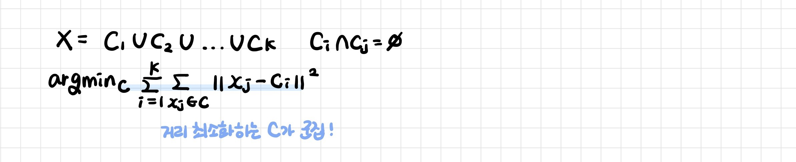
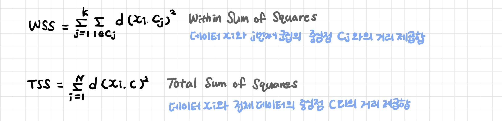
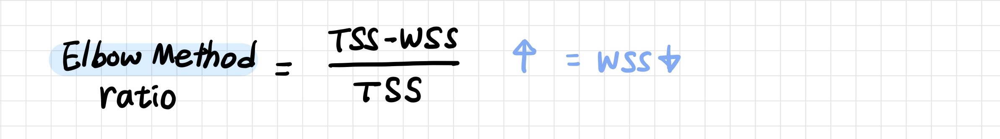
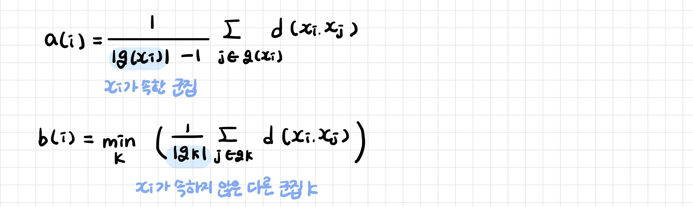

# K-평균 군집화

> K-Means Clustering

[TOC]

**각 군집에 할당된 데이터와 군집의 중심점 사이의 평균 거리를 최소화하도록 중심점을 업데이트하며 군집화하는 모델**

- K: 데이터 클러스터의 수
- Means: 각 클러스터에 할당된 데이터와 그 클러스터 중심까지의 평균 거리



| **장점**                                                     | **단점**                                                     |
| ------------------------------------------------------------ | ------------------------------------------------------------ |
| 구현이 비교적 간단하다<br>새로운 데이터의 클러스터를 찾는 계산량이 적다 | k를 직접 정해야한다<br>이상치 데이터에 민감하다: 평균값을 다루기 때문<br>초기값에 위치에 따라 결과 불확실<br>군집의 크기/밀도가 다를 경우, 분포가 특이할 경우 군집 형성이 어렵다 |

여러번 군집화로 가장 많이 등장하는 군집에 할당하는 majority voting방법으로 보완하기도 한다

[K-Means Clustering 동작과정 보기](https://www.naftaliharris.com/blog/visualizing-k-means-clustering/)

<br>

---

<br>

## 1. K-Means Clustering

### 1-1. 군집 형성

동시에 해를 찾기 어려운 문제를 풀 때 사용하는 EM 알고리즘을 기반으로 한다

- 각 군집의 중심점 위치
- 각 데이터가 어떤 군집에 속하는지

```
1. K개의 임의의 중심점을 설정한다
2. Expectation - 군집형성: 각 데이터들을 가장 가까운 중심점으로 할당한다
3. Maximization - 군집으로 지정된 데이터들을 기반으로 해당 군집의 중심점을 갱신한다.
4. 중심점이 갱신되지 않을 때가지 2~3번의 과정을 반복한다
```

<br>

### 1-2. 거리 측정 방식

- 맨하탄거리: 각 축에 대해 수직으로 이동하면서 계산

- 유클라디안 거리: 가장 짧은 거리 계산

<br>

## 2. K 최적화

### 2-1. Elbow method

군집 간의 분산과 전체 분산의 비율을 보고 판단

- WSS: 군집 내 데이터의 분산 (군집된 데이터와 중심점의 거리를 제곱하여 더한 것)

- TSS: 전체 데이터의 분산 (전체 데이터와 중심점의 거리를 제곱하여 더한 것)



- 군집이 잘 되었다면 WSS가 작아진다
- Elbow Method가 급격하게 증가하는 지점



**inertia (WSS)**: 각 데이터로부터 자신이 속한 군집의 중심점까지의 거리

- 군집 내의 데이터들이이 얼마나 퍼져 있는지

- 군집 내 데이터들과 중심점 간의 거리의 합 

- 군집의 응집도를 의미: 군집화가 잘 되었면 각 군집의 데이터들이 오밀조밀하게 뭉칠 것이기 때문

```
inertia 값이 낮을수록 군집화가 잘 된 것
inertia 값이 급격하게 낮아지는 k의 개수가 적정한 군집의 개수
```

<br>

### 2-2. Sulhouette method

데이터가 해당 군집 내 데이터와 얼마나 가깝고 가장 가까운 다른 군집과 얼마나 먼지 나타내는 지표

데이터와 그 데이터가 속한 군집의 다른 데이터들과의 거리를 계산

- 1에 가까우면 좋은 군집: 자신이 속한 군집에 잘 속해 있다

- 0에 가까우면 군집의 경계에 위치했다

- -1에 가까우면 잘못된 클러스터에 할당되었다



- a(i): 데이터 i와 i가 속한 군집의 데이터들과의 거리

- b(i): 데이터 i와 i가 속하지 않은 다른 군집의 데이터들과의 최소 거리


<br>

```
from sklearn.cluster import KMeans
model = KMeans(n_clusters=k)
model.fit(data)
model.predict(samples)

print (model.inertia_)
```

```'
# silhouette_sample() 개별 관측치의 실루엣 계수 반환
# silhouette_score() 실루엣 계수들의 평균

from sklearn.metrics import silhouette_samples, silhuette_score
```

<br>

---

<br>

## 3. K-means++

일반적인 K-Means의 랜덤한 중심점 설정 문제를 해결하기 위해 생긴 알고리즘

```
1. 데이터 중 랜덤하게 1개를 첫번째 중심점으로 지정한다.
2. 나머지 데이터들과 첫번째 중심점까지의 거리를 계산하여 가장 먼 데이터를 그 다음 중심점으로 지정한다
3. 중심점이 k개가 될 때까지 2번을 반복한다.
```

- 초기 중심점을 보다 전략적으로 설정하므로 K-Means 보다 더 최적의 군집화를 할 수 있다
- K-Means보다 속도가 빠르다

```
from sklearn.cluster import KMeans
model = KMeans(n_clusters=k,  init='k-means++')
```

<br>

----

<br>

## 4. k-medoid clustering

이상치에 영향을 많이 받는 평균값 대신 중앙값으로 계산

