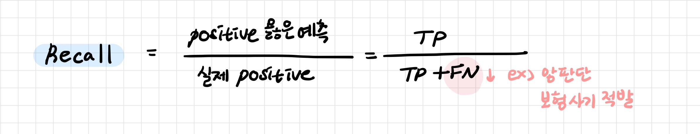

# 분류 모델 성능 평가

> 분류 모델은 예측한 값이 범주이므로 이에 맞게 성능 평가를 하게 된다

[TOC]

## 1. 혼동 행렬

> Confusion Matrix

- 뒷 부분의 Positive/Negative는 분류 예측 값
- 앞 부분의 True/False는 예측한 분류가 맞았는지 틀렸는지
- 혼동 행렬을 바탕으로 성능 지표를 계산한다

 

### 1-1. Accuracy 정확도

전체 예측에서 옳은 예측의 비율 (모델이 얼마나 정확하게 분류를 하는지)

### 1-2. Precision 정밀도 

Positive로 분류된 경우 중 실제 Positive의 비율

가짜인데 진짜로 잘못 찾으면 안되는 것

### 1-3. Recall 재현율

> Sensity, TP Rate, Hit Rage

실제 Positive 중 Postivie로 분류된 비율 (모델이 얼마나 정확하게 Positive 값을 찾는지)

진짜인데 가짜로 잘못 찾으면 안되는 것

### 1-4. Specificity

Negative로 분류된 경우 중 실제 Negative의 비율

### 1-5. FP Rate

> False Alarm Rate

실제 Negative 중 Postivie로 잘못 분류된 비율

### 1-6. F1 score

불균형한 데이터의 경우 Recall과 Precision의 조화 평균인 F1 score를 사용 

- 시스템의 성능을 하나의 수치로 표현하기 위해 사용하는 점수 (0~1)
- Recall과 Precision 두 값이 골고루 클 때 큰 값

### 1-7. Kappa

두 평가자의 평가가 얼마나 일치하는지 평가하는 값 (0~1)

 

---

 

## 2. ROC 커브

> Receiver Operating Characteristics

가로축을 FP Rate(1-Specificity), 세로축을 TP Rate (Recall)로 하여 시각화한 그래프

임계값을 변경하면서 혼동행렬을 구하고 FPR, TPR을 계산해 그림으로 표현한 것

- 그래프가 위로 갈수록 좋은 모델

- Y=X 보다 위에 있어야 쓸모 있는 모델 

 

### 2-1. ROC AUC

> ROC Area Under Curve

ROC 그래프의 면적, 최대값은 1

 

### 2-2. Precision Recall Plot

가로축을 Recall, 세로축을 Precision로 하여 시각화한 그래프

- 그래프가 위로 갈수록 정확도가 높은 모델

- Base Line P/(P+N) 보다 위에 있어야 쓸모 있는 모델

- 불균등 데이터에서 유용

