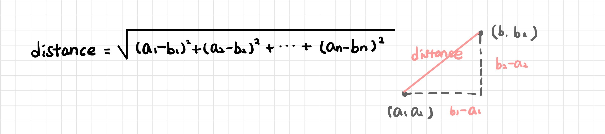
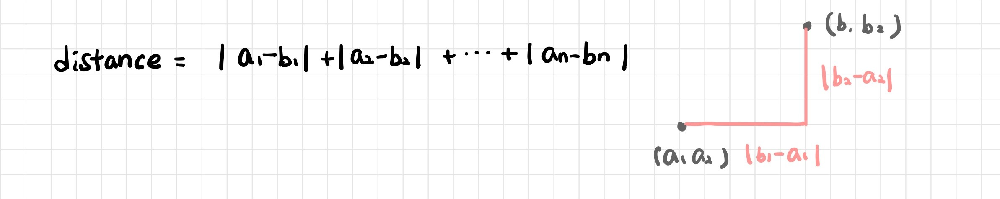
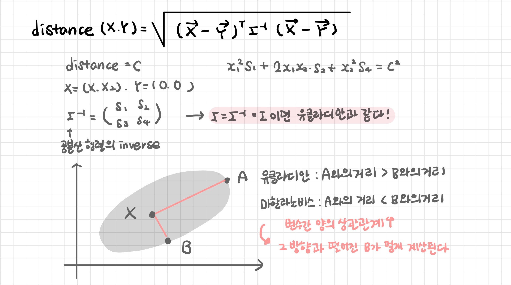
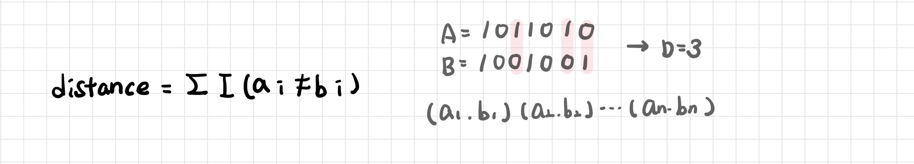

# KNN

> K-Nearest Neighbor: K-최근접 이웃

[TOC]

**데이터가 주어지면 기존의 데이터 중 가장 가까운 k개의 이웃 데이터를 확인하여 더 많은 데이터가 포함되어 있는 범주로 분류하는 방법**

- 분류: 범주형/명목형 변수 -> 가장 많이 나타나는 범주 선택

- 회귀: 연속형/수치형 변수 -> k개의 KNN 평균

| 장점                                                         | 단점                                                         |
| ------------------------------------------------------------ | ------------------------------------------------------------ |
| 로버스트: 노이즈 영향을 크게 받지 않는다 1-NN에 한하여 모델 성능 보장 | 거리 계산 시간이 오래 걸린다 최적 이웃의 수와 거리 척도에 대한 적합성 불분명 차원의 영향을 많이 받는다: 차원 축소 필요 |

- n개의 특성 feature을 가진 데이터는 n차원의 공간의 점으로 표현 가능
- **유사도(Similarity)**: 유사한 특성을 가진 데이터는 거리가 가까우며 유사한 범주에 속한다

- Lazy Model: 모델을 구축하는 사전 모델링이 필요 없다
  - 훈련 데이터를 기반으로 모델을 만들고 테스트 데이터로 검증하는 훈련 과정이 필요없다
  - 각각의 관측치 instance만을 이용하여 빠르게 결과 도출

 

---

 

## 1. 정규화

> Normalization

**모든 특성들을 모두 고르게 반영하기 위해 변수들의 평균과 분산을 일치시키는 작업**

- 어떤 변수에 해당하는 평균 혹은 편차가 훨씬 크다면 다른 변수는 반영되지 않을 수 있다
- 최소값을 0, 최대값을 1로 고정하고 모든 값을 0과 1사이 값으로 변환
- 평균과 표준편차로 평균으로부터 얼마나 떨어져 있는지를 z-점수로 변환

 

---

 

## 2. k 개수 선택

> 이웃 수 k

k값을 변화시키면서 분류 정확도를 확인하며 개수를 선택한다

- **다수결 Majority Voting**: 이웃의 범주 가운데 빈도가 높은 범주로 예측
  - 과적합 해결: test error를 기준으로 가장 error가 낮을 때의 k값
  - 샘플로스 해결: 데이터가 많지 않은 경우 (cross validation으로 최적의 k 선정)

- **가중합 Weighted Voting**: 거리가 가까운 이웃의 정보에 가중치를 주는 방법

 

### 2-1. Overfitting

**k가 작으면 과적합 overfitting**

- 데이터의 지역적 특징을 지나치게 반영한다 (분류 경계면이 복잡)

- 주변 다른 이웃들까지 충분히 고려하지 못하고 근처에 있는 소수의 점에 민감하게 영향을 받는다

- 이상치의 영향을 많이 받는다

 

### 2-2. Underfitting

**k가 너무 크면 과소적합 underfitting**

- 과하게 정규화된다 (분류 경계면이 단순)

- 분류기가 데이터를 충분히 세세히 보지 못하고 모든 점이 결국 동일한 방식으로 분류한다

 

---

 

## 3. 거리 계산

데이터와 데이터 사이의 거리 구하는 방식 

- 설명 변수가 연속형일 경우: 유클리디안 거리, 맨하탄 거리
- 설명 변수가 범주형일 경우: 해밍 거리 (다른 범주를 다 더하는 것)

 

### 3-1. 유클리드 거리

> Euclidean Distance

두 관측치의 직선 최단 거리

 

### 3-2. 맨해튼 거리

> Manhattan Distance

점과 점사이의 X축과 Y축을 따라 간 거리: 절대값을 바로 합산

 

### 3-3. 마할라노비스 거리

변수 내 분산과 변수 간 공분산을 반영하여 거리 계산: 변수 간 상관관계 고려

 

### 3-4. 해밍 거리

> Hamming Distance

정확히 같은지만 고려하는 지표

맞춤법 검사: 각 문자가 차원이고 서로 다른 글자 개수만 세주는 방법

