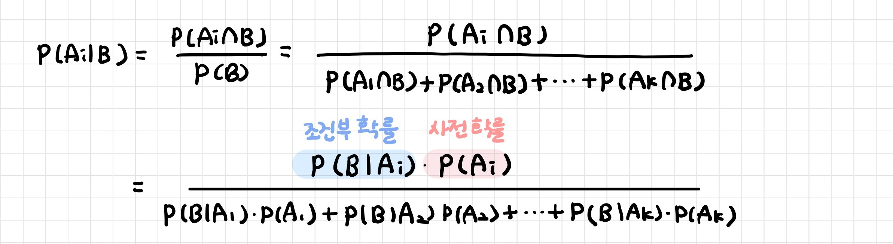
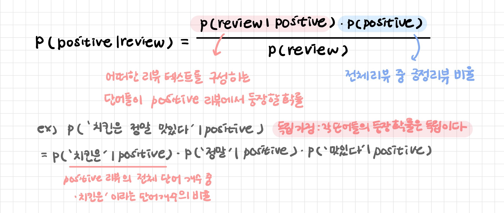

# 나이브베이즈

> Naive Bayes

[TOC]

## 1. 베이즈 정리 

새로운 사건의 확률을 위해 이미 일어난 사건을 고려하는 것 

- B라는 조건이 주어졌을 때 A의 확률을 구하는 것
- 사건 B가 발생함으로써(= 사건 B가 진실이라는 것을 알게 됨으로써, P(B)=1이라는 것을 알게 됨으로써) 사건 A의 확률이 어떻게 변화하는지를 표현한 정리


- **독립사건 Indepenent Events** : 어떤 사건이 발생하더라도 다른 사건의 발생 확률에 영향을 미치지 않는다

- **우도 Likelihood** : 나타난 결과에 따라 가설들을 평가할 수 있는 측도
  - 각 가설에 대한 우도는 그 가설을 지지하는 정도
  - 관측된 표본에 기초하여 미지의 모수에 대한 추정/가설의 정확성의 질적 평가 척도
  - 우도의 확률적 표현 = 조건부 확률
- **조건부 확률 Conditional Probability** : 어떤 사건이 발생했을 때 다른 사건이 발생할 확률 

- **사전 확률 prior probability** : 특정 사건이 발생하기 전의 확률
  - P(A)는 사건 B가 발생하기 전에 가지고 있던 사건 A의 확률

- **사후 확률 posteriori probability**: 사건 발생 후에 어떤 원인으로부터 일어난 것이라고 생각되는 확률 
  - P(A|B)에서 B는 이미 일어난 사건, A는 B가 나올 수 있게 한 과거의 특정사건: 사건 B가 발생한 후 갱신된 사건 A의 확률
  - 사후확률은 베이즈 정리에 기반하여 사전확률분포와 우도함수의 곱

```
빈도주의적 관점: 희귀병 발병률이 1/100000, 검사 정확도가 99%라면 어떤 환자가 희귀병을 가지고 있을 확률 = 1/100000 × 0.99

베이지안 관점: 희귀병 검사 결과가 양성인데 정말 그러한지
- 분모 = 검사결과가 양성인 경우 (환자가 희귀병을 가지고 있고 검사 결과가 정확한 경우 + 환자가 희귀병을 가지고 있지 않은데 검사 결과가 잘못된 경우)
- 분자 = 환자가 희귀병을 가지고 있고 검사 결과가 정확한 경우 
```

<br>

---

<br>

## 2. 나이브 베이즈 분류기

> Naive Bayes Classifier

**B라는 조건이 주어졌을 때 A의 확률을 구하는 것** 

- 베이즈 정리에 기반한 통계적 분류 기법
- 설명변수 (Feature)에 따라 반응변수 (Label)을 분류하는 베이즈 정리 사용


- 설명변수 Feature가 서로 독립이어야한다: 데이터의 특성들이 각각 독립적이고 동등하게 중요하다는 Naive(순진한) 가정

- B를 데이터, A를 레이블로 보면 임의의 데이터가 특정 레이블에 속할 확률을 구하는 것



| 장점                                                     | 단점                                                         |
| -------------------------------------------------------- | ------------------------------------------------------------ |
| - 간단하고 빠르고 정확하다<br>- 대용량 데이터에 적합하다 | 현실의 데이터는 설명변수 (feature) 간 독립성 가정을 성립하기 어렵다 |

- 스팸 메일 필터, 텍스트 분류, 감정 분석, 추천 시스템 등에 사용
- `P(스팸|이메일)` 과 `P(not 스팸|이메일)` 인 확률을 계산하여 더 높은 값이 나타나는 클래스로 예측

<br>

### 2-1. 가우시안 나이브 베이즈

> Gaussian Naive Bayes

**설명변수가 연속형 (간격 변수, 비율 변수)인 경우** 사용하는 나이브 베이즈 기법

- 표본 평균과 표본 분산을 가진 정규분포 하에서 베이즈 정리를 사용

- 대부분 매우 고차원인 데이터 세트에 사용

- 정규분포를 가정한 표본들을 대상으로 조건부 독립을 나타내, 항상 같은 분모를 갖는 조건하에서, 분자의 값이 가장 큰 경우,즉 확률이 가장 높은 경우를 "선택"하는 것이다.
- 가우시안 나이브베이즈 모형 `GaussianNB`의 가능도 추정 관련 속성
  - `theta_`: 정규분포의 기댓값 μμ
  - `sigma_`: 정규분포의 분산 σ2

<br>

### 2-2. 다항분포 나이브 베이즈

> Multinomial Naive Bayes

**설명변수가 범주형 (명목 변수, 순위 변수)인 경우** 사용하는 나이브 베이즈 기법

- 텍스트 같은 희소한 데이터를 카운트하는데 사용

- 다항분포 나이브 베이즈: 카운트 데이터 (ex. 문장 속에 사용된 단어 횟수)

- 베르누이 나이브 베이즈: 이진 데이터 (ex. 문서 내 중복단어를 없애 분석 정확성을 높인다: 한 단어가 문서 내에 등장했는지 여부)

<br>

```
가우시안 나이브 베이즈: 클래스별로 각 특성의 표준편차와 평균을 저장하여 이를 데이터 포인트와 비교해 예측 값을 출력
다항분포 나이브 베이즈: 클래스별로 특성의 평균을 계산
```

<br>

---

<br>

## 3. 텍스트 분류



```
- 베이즈 정리에 사용되는 확률을 계산하기 위해 레이블이 지정된 데이터 세트가 필요하다.
- 데이터 세트에 포함된 텍스트에서 등장하는 단어들이 특성(feature)이 되며 이 특성(단어)들은 모두 독립적인 것으로 가정한다.
- 어떤 텍스트가 있을 때 그것이 특정 레이블에 속할 확률 `P(레이블 | 텍스트)`를 계산하고 이 중 확률이 가장 높은 레이블로 예측한다.
```

<br>

### 3-1. 스무딩 

>  Smoothing

**우도값이 0이 되지 않도록 보정하는 평활화(smoothing) 기법**: i번째 단어가 긍정 문서에서 한 번도 등장하지 않더라도 그 우도 확률이 0이 되지 않도록 분자와 분모에 적당히 작은 상수를 더해준다


ex. 만약 '치킨이'라는 단어가 긍정 리뷰 데이터 셋에서 한 번도 등장하지 않은 단어라면  `P('치킨이' ∣ positive)` 값은 0이 되면서 `P("이 치킨은 정말 맛있다" ∣ positive)`의 값까지 0이 되는데 이를 방지하기 위해 값을 조절해주는 것


<br>

### 3-2. 데이터 가공

- 문장 부호, 불용어 등을 제거한다.
- 모든 단어를 소문자로 통일한다. (한국어는 해당사항 없지만)
- ngram모델을 사용한다. 예를 들어 “이 음식은 너무 맛있다”는 문서가 있다면 여기서 feature는 “이”, “음식은”, “너무”, “맛있다”가 될 거다. 그러나 만약 bigram 모델을 사용하면 “이 음식은”, “음식은 너무”, “너무 맛있다”가 된다. 나이브 베이즈에서는 애초에 각 어휘들이 독립적이라고 가정하는데 이렇게 bigram 모델을 사용하면 연달아 등장하는 어휘를 고려하는 셈이니 조금 나아지는 편이다.
- 형태소 단위로 쪼개서 집어 넣는다. 예를 들면 “공부하다”, “공부했다”, “공부하고”, “공부하는” 등의 다양한 어휘가 등장할 때 이것들 각각을 어휘로 보지 않고 “공부하-“라는 대표형으로 묶어서 보는 게 효과적이기 때문이다.
- 특정 품사들만 선택해서 사용한다. 형태소 분석을 하면 각 어휘가 어떤 품사를 지니는지(태깅) 알 수 있기 때문에 이걸 바탕으로 일반명사, 고유명사, 형용사, 동사, 일반부사 위주로 사용하면 결과가 더 좋을 수도 있다. 물론 케바케다. 게다가 형태소를 나누는 기준이나 체계도 딱 정해져 있는 건 아니라…

<br>

### 3-3. 자연어 처리

> 나이브 베이즈 알고리즘을 공부하면서 참고할 만한 자연어 처리 기법

**bag-of-words: 어휘의 빈도(개수)에 대해 통계적 언어 모델을 적용해서 나타낸 것**

- 텍스트를 가방 안에 넣고 섞는 느낌!

- 나이브 베이즈처럼 단어의 등장 순서를 무시하고 텍스트 내 빈도만을 따져서 텍스트를 표현
- vectorization: 단어 사전을 만들고 이를 기반으로 텍스트를 벡터로 바꿔서 분석에 사용한다

**유니그램(unigram) 모델: 도메인(domain)별로 각 단어의 등장확률 표를 활용하는 모델**

- 학습말뭉치에 등장한 각 단어 빈도를 세어서 전체 단어수로 나누어준 것

- 문자열이 나타날 확률 =단어별 등장 확률의 반복적인 곱 

- 말뭉치 등장 빈도가 높은 단어가 많이 포함된 텍스트일수록 해당 텍스트의 출현확률이 높아진다 

- 나이브 베이즈의 사전확률을 제외한 과정과 동일