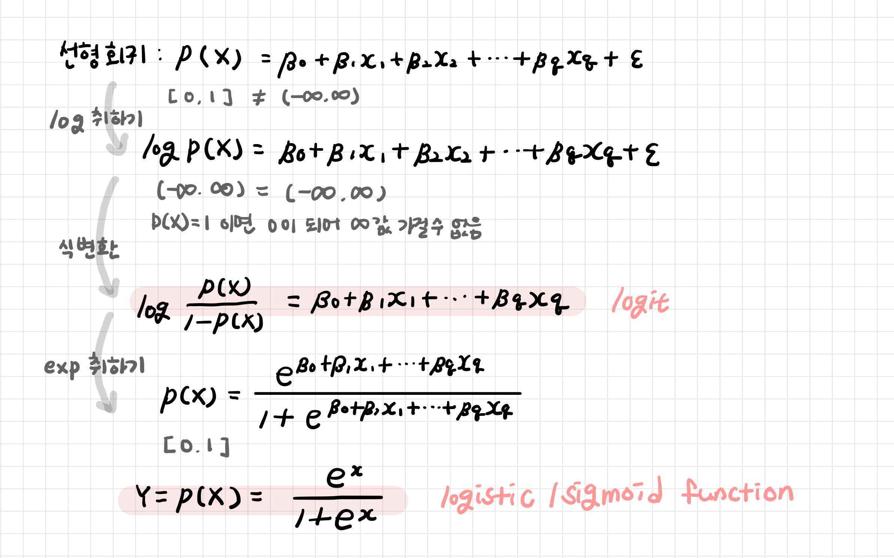
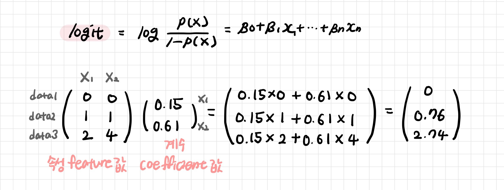
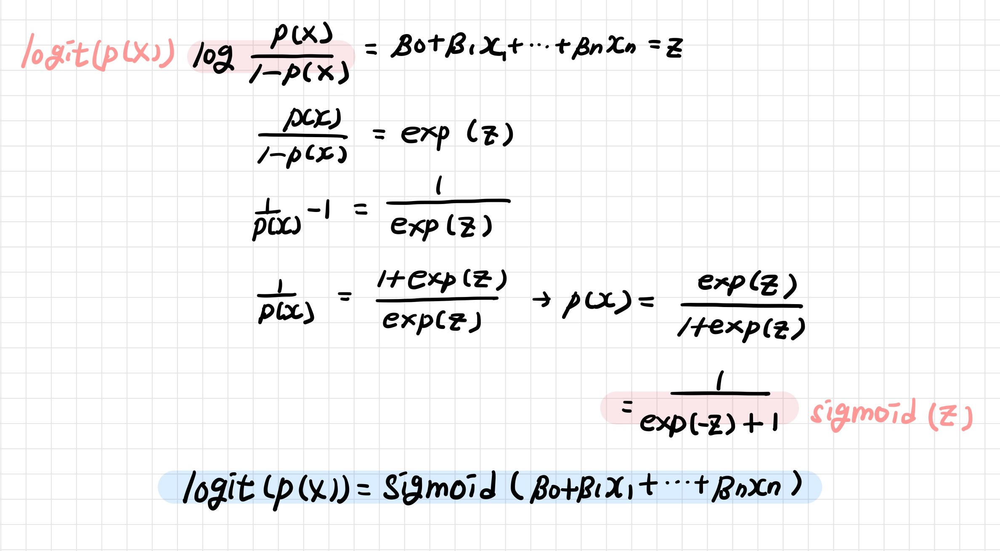
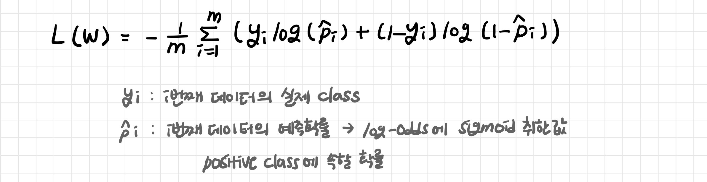
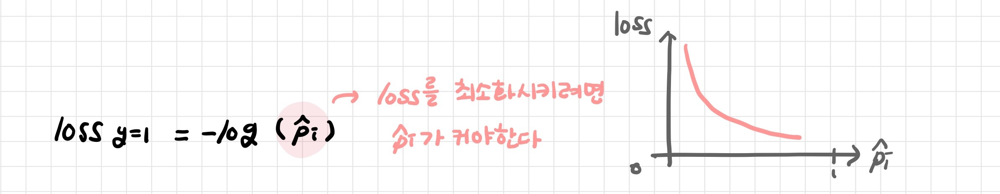
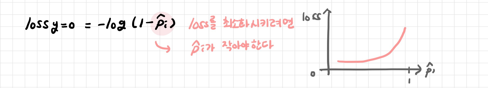

# 로지스틱 회귀

> Logistic Regression

[TOC]

**회귀를 사용하여 데이터가 특정 범주에 속할 확률을 0에서 1 사이의 값으로 예측하고 그 확률에 따라 분류하는 방법**

- 2진 분류 모델 binary classification 
  - positive class (1) : detect 하고자 하는 class
  - negative class (0)

- 선형회귀의 출력범위가 -∞부터 ∞이므로 Y가 범주형 변수인 경우 선형회귀 모델을 구축하면 기준을 벗어나는 확률 값이 생기게 된다
- 종속변수로 Y 대신 로짓함수 사용: 출력범위를  0과 1사이로!
- Logit을 종속변수로 정의하고 Logit과 예측변수와의 관계를 선형으로 표현한 모델

|               | 선형 회귀분석  | 로지스틱 회귀분석 |
| ------------- | -------------- | ----------------- |
| **종속 변수** | 연속형 변수    | 이산형 변수       |
| **계수 추정** | 최소자승법 MSE | 최대우도법 MLE    |



**1. 확률 추정치 예측**: 각 집단에 속하는 확률의 추정치를 예측 (1에 속하는 확률 P(Y=1)의 추정치)

```
1-1. 모든 속성 feature 들의 계수 coefficient 와 절편 intercept을 0으로 초기화한다.
1-2. 각 속성 feature 들의 값 value 에 계수 coefficient 를 곱해서 Log-Odds를 구한다.
1-3. Log-Odds를 sigmoid 함수에 넣어서  0과 1사이의 확률값을 구한다.
```

**2. Loss 계산과 최적화**

```
2-1. 계산한 확률값과 실제 label을 비교하여 Loss를 계산한다.
2-2. gradient descent로 최적화된 coefficients와 intercept 파라미터를 계산한다.
```

**3. 범주 분류**: 추정 확률을 기반으로 분류 기준 값을 정하고 특정 범주로 분류

```
5. classification threshold 값을 조절하여 positive와 negative를 어떻게 나눌지를 설정한다.
```

<br>

---

<br>

## 1. 회귀계수 추정

최소제곱법 MSE가 아닌 최대우도법 MLE (Maximum likelihood)


<br>

---

<br>

## 2. 확률 예측

특정 데이터가 특정 범주에 속할 확률을 예측하기

<br>

### 2-1. Odds

> 특정 사건의 승산: (0, ∞)

**특정 사건이 일어나는 횟수가 특정 사긴이 일어나지 않는 횟수보다 얼마나 더 많은지를 나타내는 비율**

- P(A)가 1에 가까울수록 승산이 오른다 

- 승산이 커질수록 사건 A가 발생할 확률이 커진다


<br>

### 2-2. Log-Odds

> 로짓(logit) 함수: odds에 log를 취한 값: (-∞, ∞)

특정 데이터의 속성 값 feature values을 해당 데이터가 positive class에 속할 가능성으로 매핑: 곱의 합 dot product (내적) 



<br>

### 2-3. Sigmoid Function

> 시그모이드 함수, 로지스틱 함수

Log-Odds를 Sigmoid 함수에 넣어서 0부터 1사이의 값으로 변환

특정 데이터가 positive class에 포함될 확률을 계산하게 된다!



<br>

---

<br>

## 3. 최적화 Log-Loss

> 최적화된 계수 coefficients와 절편 intercept를 구하기

**Loss Function**: 모델의 적합성을 평가하기 위해 각 데이터 샘플의 손실(모델 예측이 얼마나 잘못되었는지)을 계산하고 평균내는 함수 

**로그 손실 Log-Loss**: 로지스틱 회귀에 대한 손실 함수

- 로지스틱 회귀가 확률을 제대로 예측해주는지, 계수 coefficients 와 절편 intercept 이 적절한지 확인하기 위해 손실(Loss)을 고려
- 로지스틱 함수를 구성하는 계수와 절편에 대해 Log Loss(로그 손실)을 최소화하는 값을 찾는 것



<br>

- y = 1
  - Loss를 최소화시키려면 예측 확률이 커야한다
  - 예측된 확률 값이 원래 class인 1에 가까울수록 loss는 줄어든다



- y = 0

  - Loss를 최소화시키려면 예측 확률이 작아야한다
  - 예측된 확률 값이 원래 class인 0에 가까울수록 loss는 줄어든다



```
로그손실함수는 최소값을 찾는 정규방정식이 없기 때문에 경사하강법(Gradient Descent)을 사용하여 모든 데이터에서 로그 손실을 최소화하는 계수를 찾는다
```

<br>

---

<br>

## 4. 범주 분류

**Classification Thresholding**: 예측된 확률 값으로 class를 분류하는데 사용되는 임계값

- 기본 임계 값은 0.5

- 필요에 따라 모델의 임계값을 변경 가능

  ex) 아래의 그림에서 threshold를 0.5보다 작게 설정하면 positive class(암으로 진단)를 더 많이 예측하게 된다

  - 노란색 부분 감소: 암 환자임에도 불구하고 정상으로 판단할 오류 감소

  - 정상 사람을 암환자라고 판단할 오류는 증가하지만 놓치고 있던 암환자를 찾아낼 수 있다


