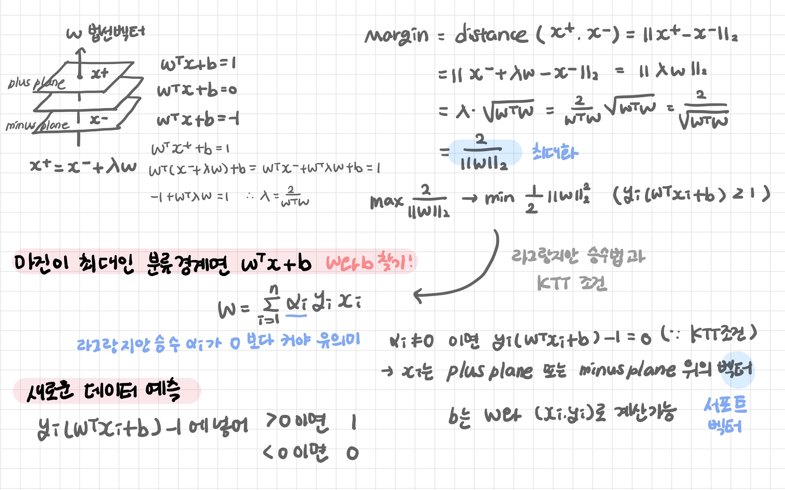

# 서포트 벡터 머신

> Support Vector Machine; SVM

[TOC]

**데이터 간 경계를 정의하여 데이터를 분류하고 새로운 데이터의 class를 예측하는 방법** 

- 하나의 그룹을 다른 그룹과 분리하는 최적의 경계를 찾아내는 알고리즘

- 중간크기의 데이터셋과 특성이 많은 복잡한 데이터셋에서 좋은 성능
- 선형판별 함수 분류모델


```
1. training set으로 decision boundary를 찾고 SVM 모델을 학습한다.
2. SVM 모델에 새로운 데이터를 전달하여 class 예측한다
```

<br>

---

<br>

## 1. Decision Boundary

**두 데이터로부터 가장 멀리 떨어진 decision boundary가 가장 적합**

- 데이터를 잘못 분류할 가능성을 낮춰준다

- hyperplane (하이퍼플레인): 차원의 수가 늘어나 평면으로 나타낼 수 없는 decision boundary

<br>

---

<br>

## 2. Support Vectors

**decision boundary와 가장 가까운 데이터 포인트** 

- 이 데이터 포인트들이 decision boundary 결정
- 각 데이터 포인트를 좌표 공간 상에 나타내어 원점에서 출발하는 위치벡터로 만들 수 있다

- `n개의 feature가 있다면 최소 n+1개의 support vectors가 존재`
- 모든 training 데이터를 사용하지 않고 support vector만 사용하면 된다!

|  |  |
| ------------------------------------------------------------ | ------------------------------------------------------------ |

<br>

---

<br>

## 2. Margin

**support vector와 decision boundary간의 거리**

- margin이 크면 클 수록 좋은 decision boundary

| 하드 마진(hard margin)                                 | 소프트 마진(soft margin)                                     |
| ------------------------------------------------------ | ------------------------------------------------------------ |
| 아웃라이어를 허용하지 않도록 기준을 잡은 것            | 아웃라이어들이 마진 안에 어느 정도 포함되도록 기준을 잡은 것 |
| Support Vectors와 decision boundary 사이의 거리가 좁다 | Support Vectors와 decision boundary 사이의 거리가 멀다       |
| Margin이 작다                                          | Margin이 크다                                                |
| 오버피팅(overfitting)                                  | 언더피팅(underfitting)                                       |
| C ▲, gamma ▲                                           | C ▼, gamma ▼                                                 |

<br>

### 2-1. C 

> Controls tradeoff detween smooth decision boundary and classfying training points correctly

얼마나 error을 허용할 것인지

**C가 큰 경우: hard margin**

- 작은 margin: dicision boundary가 error를 갖는 것을 강하게 제한
- overfitting: 이상치의 영향을 너무 많이 받게 된다
- 굴곡진 decision boundary

**C가 작은 경우: soft margin**

- 큰 margin: dicision boundary가 error를 갖는 것을 약하게 제한
- underfitting: 이상치에 영향을 덜 받게 되지만 error를 많이 갖게 된다
- 직선에 가까운 decision boundary

<br>

### 2-2. Gamma

> Defines how far the influence of a single training point reaches 

reach: decision boudary의 굴곡에 영향을 주는 데이터의 범위

**Gammar가 큰 경우**

- reach가 좁다: 가까이 있는 포인트들만 선의 굴곡에 영향

- 멀리 있는 포인트는 영향이 없고 가까이 있는 포인트는 영향이 크다

- 굴곡진 decision boundary

**Gamma가 작은 경우**

- reach가 멀다: 대부분의 포인트가 선의 굴곡에 영향
- 가까이 있는 포인트의 영향이 상대적으로 작다: 선이 포인트 하나 때문에 변하지 않는다

- 직선에 가까운 decision boundary

<br>

```
C: 두 데이터를 정확히 구분하는 것에 초점 (하나의 decision boudnary)
Gamma: 개별 데이터마다 decision boundary를 만드는 것에 초점 (여러 개의 decision boudnary 가능)
```


<br>

---

<br>

## 3. Kernels

비선형 데이터의 경우 데이터를 차원을 높여 선형적으로 분리해줄 수 있는 평면

- 커널 트릭(Kernel Trick):  저차원 공간을 고차원 공간으로 매핑해주는 작업
- 데이터를 한 차원 위의 공간으로 projection하여 데이터를 선형적으로 분리한다

다항 커널(polynomial kernel: 2차원 데이터를 3차원 공간상으로), 가우시안 커널 (RBF Radial Basis Function: 2차원 데이터를 무한한 차원의 공간상으로), 시그모이드 커널 등

https://www.youtube.com/watch?v=3liCbRZPrZA&t=42s

<br>

---

<br>

## 4. SVR

> Support Vector Regression

종속변수가 연속형일 경우 margin 밖에 있는 error가 최소가 되도록 동작 (margin 안에 최대한 많은 관측치)

<br>

