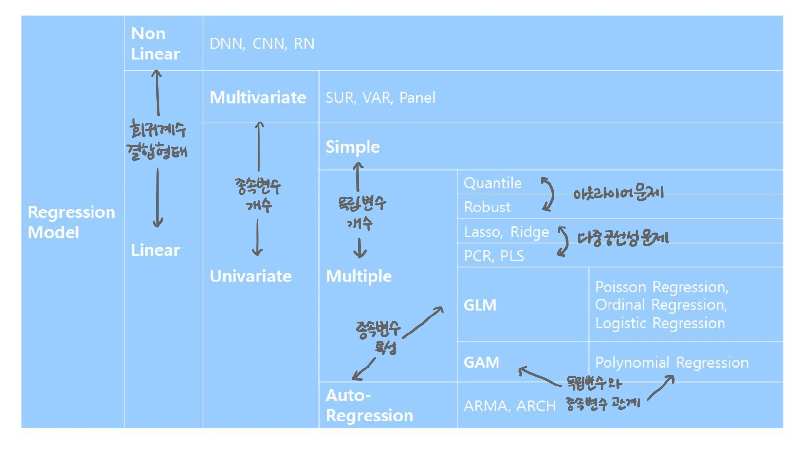

# 회귀분석

> Regression Analysis

연속형 변수들에 대해 설명변수와 반응변수 사이의 함수적인 관계를 모형화하여 분석하는 통계적 기법

- 변수들 사이의 관계, 관계의 정도, 관계식
- 관계식을 유도하여 독립변수의 변화에 따른 종속변수의 변화 예측

- 원하는 반응변수를 위한 설명변수의 값 조절

 

 

### 데이터 탐색과 전처리 

**선형회귀분석의 조건**: 모형의 선형성, 오차의 등분산성/정규성/독립성, 설명변수 간의 독립성

- 결측값, 중복값

- 설명변수 간 다중공선성: 산점도, 상관계수, 분산팽창지수
- 설명변수 표준화, 척도 변환

- 질적 설명 변수: 더미변수 사용

 

### 성능평가

실제값에 얼마나 가깝게 예측했는지

- 평균제곱오차 MSE ▼

- 평균제곱근오차 RMSE ▼

- R Squared ▲
