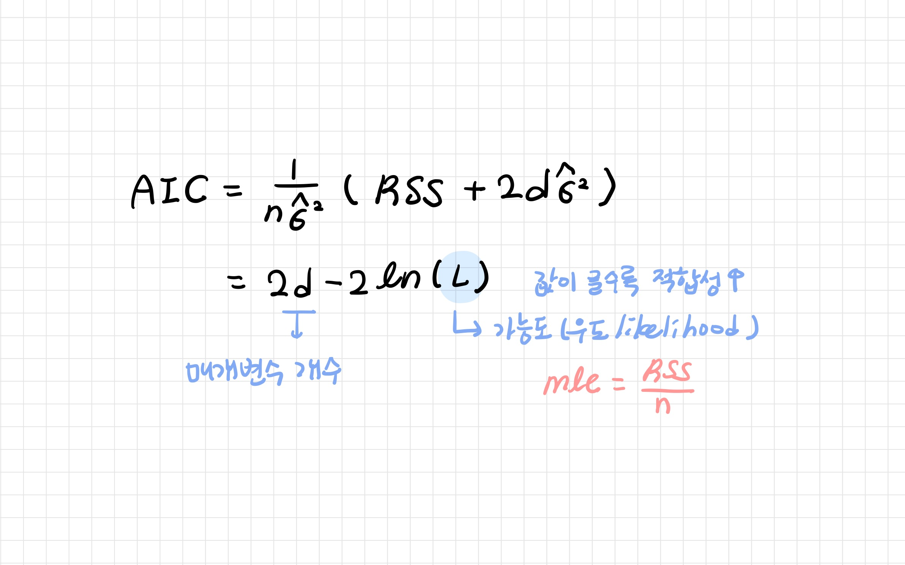

# 7_최적모델선택

[TOC]

최적의 모델 선택: 변수 추가 및 제거의 타당성 검토


- RSS와 R2: 훈련오차와 관련있기 때문에 모델에 포함되는 변수의 수가 증가할수록 감소 (설명변수 전체를 포함하는 모델이 항상 가장 작은 RSS와 R2)

- 모델 크기에 대해 훈련오차를 조정하여 검정오차가 낮은 모델을 선택해야한다

```
- 검정오차 간접 추정: 과적합으로 인한 편향을 고려하도록 훈련오차를 조정
- 검정오차 직접 추정: 검증셋 기법 또는 교차검증 기법 사용
```

<br>

---

<br>

## 1. Cp

**가장 낮은 Cp값을 가지는 모델 선택**


<br>

---

<br>

## 2. AIC

> Akaike Information Criterion; 아카이키 정보 기준

모형의 정확성 (accuracy)과 복잡성 (complexity)에 관한 정보 엔트로피

**가장 작은 AIC값을 가지는 모델 선택**



변수가 많을수록 모형의 적합성 (fitness) ↑ 복잡성 (complexity) ↑

<br>

---

<br>

## 3. BIC

> Bayesian Information Criterion

**가장 작은 BIC값을 가지는 모델 선택**


<br>

---

<br>

## 4. deviance

> 이탈도, 편차

적합 정도를 나타내는 척도


변수가 많을수록 모형의 적합성 (fitness) ↑ 이탈도 (deviance) ↓

<br>

---

<br>

## 5. 수정된 결정계수

> Adjusted coefficient of determination

**가장 큰 R2 값을 가지는 모델 선택**


- 기존의 R2이 불필요한 변수를 추가시키더라도 증가하는 성향과 설명변수의 수를 반영하지 못하는 단점을 보완

- 다른 수의 변수들을 포함하는 모델들의 집합에서 모델을 선택할 때 많이 사용

<br>

---

<br>

## 6. 축차제곱합 / 부분제곱합

> Sequential sum of squares

### 6-1. Type Ⅰ SS

순차적으로 한 개씩의 항을 추가하면서 변하는 추가 제곱합을 구한다 -> 부분 F검정

- X1로 인한 부분 `SSR(X1)`
- X2로 인한 부분 `SSR(X2|X1)`
- X3로 인한 부분 `SSR(X3|X1, X2)`
- Xk로 인한 부분 `SSR(Xk|X1, X2, ..., Xk-1)`

제곱합의 합계 == 전체 회귀제곱합: `SSR(X1, X2, ..., Xk) = SSR(X1) + SSR(X2|X1) + SSR(X3|X1, X2) + ... +  SSR(Xk|X1, X2, ..., Xk-1)`

| Source              | df    | SS1                        | MS                         |
| ------------------- | ----- | -------------------------- | -------------------------- |
| Regression          | k     | SSR(X1, X2, ..., Xk)       | MSR(X1, X2, ..., Xk)       |
| X1                  | 1     | SSR(X1)                    | MSR(X1)                    |
| X2\|X1              | 1     | SSR(X2\|X1)                | MSR(X2\|X1)                |
| X3\|X1, X2          | 1     | SSR(X3\|X1, X2)            | MSR(X3\|X1, X2)            |
| ...                 | ...   | ...                        | ...                        |
| Xk\|X1, X2, ..., Xk | 1     | SSR(Xk\|X1, X2, ..., Xk-1) | MSR(Xk\|X1, X2, ..., Xk-1) |
| **Error**           | n-k-1 | SSE(X1, X2, ..., Xk-1)     |                            |
| **Total**           | n-1   | SST                        |                            |

<br>

### 6-2. Type Ⅱ SS

- X1로 인한 부분 `SSR(X1)`
- X2로 인한 부분 `SSR(X2|X1)`
- X3로 인한 부분 `SSR(X3|X1, X2)`
- Xk로 인한 부분 `SSR(Xk|X1, X2, ..., Xk-1)`

제곱합의 합계 != 전체 회귀제곱합

| Source                | df    | SS1                        | MS                         |
| --------------------- | ----- | -------------------------- | -------------------------- |
| Regression            | k     | SSR(X1, X2, ..., Xk)       | MSR(X1, X2, ..., Xk)       |
| X1\|X2, X3, .., Xk    | 1     | SSR(X1\|X2, X3, .., Xk)    | MSR(X1\|X2, X3, .., Xk)    |
| X2\|X1, X3, ..., Xk   | 1     | SSR(X2\|X1, X3, ..., Xk)   | MSR(X2\|X1, X3, ..., Xk)   |
| X3\|X1, X2, ..., Xk   | 1     | SSR(X3\|X1, X2, ..., Xk)   | MSR(X3\|X1, X2, ..., Xk)   |
| ...                   | ...   | ...                        | ...                        |
| Xk\|X1, X2, ..., Xk-1 | 1     | SSR(Xk\|X1, X2, ..., Xk-1) | MSR(Xk\|X1, X2, ..., Xk-1) |
| **Error**             | n-k-1 | SSE(X1, X2, ..., Xk-1)     |                            |
| **Total**             | n-1   | SST                        |                            |

