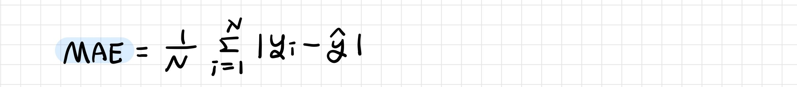
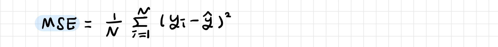
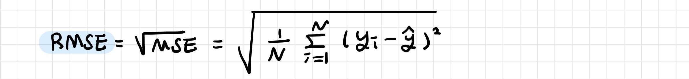
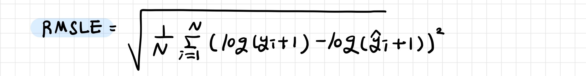
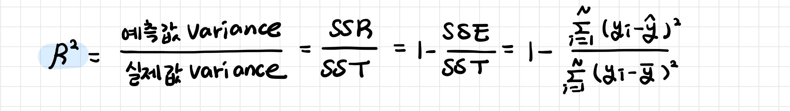

# 회귀 모델 성능 평가

> 실제 값과 회귀 예측 값의 차이를 기반으로 평가: 귀무가설을 기각하고 대립가설을 채택했다면 모델이 데이터에 적합한 정도를 평가해야한다

[TOC]

- **편차 (bias)**: 관측치가 평균으로부터 떨어져있는 정도, 평균과의 차이

- **오차 (Error)**: 모집단에서 얻은 회귀식으로 예측을 수행했을 때 실제 값과 예측 값의 차이

- **잔차 (Residual)**: 모집단에서 추출한 표본 집단에서 얻은 회귀식으로 예측을 수행했을 때 실제 값 (표본집단의 값)과 예측 값의 차이

  ▶ 추정된 값이 설명할 수 없어서 아직 남아있는 편차

<br>

## 1. 손실 함수

> Loss Function

예측 값이 실제 값과 얼마나 유사한지를 판단하는 기준

- 모델 성능의 '나쁨'을 나타내는 지표

- **손실 (Loss)**: 예측 값과 실제 값의 차이


<br>

### 1-1. MAE

> Mean Absolute Error: 평균 절대 오차

실제 값과 예측 값의 차이를 절대값으로 변환해 평균한 것

- 아웃라이어에 Robust하다: 아웃라이어에 대한 저항도 가지고 있고 데이터 특성도 잘 나타낸다
- 절대값이므로 underperformance인지, overperformance인지 알 수 없다



<br>

### 1-2. MSE

> Mean Squared Error: 평균 제곱 오차

실제 값과 예측 값의 차이를 제곱해 평균한 것

- 아웃라이어에  민감하다



<br>

### 1-3. RMSE

> Root Mean Squared Error: 평균 제곱근 오차

MSE는 오류의 제곱을 구하므로 실제 오류 평균보다 커지는 특성

MSE에 루트를 씌운 값



<br>

### 4. RMSLE

> Root Mean Squared Log Error

RMSE에 로그를 적용한 값

- 아웃라이어에 Robust하다: 아웃라이어가 있어도 변동폭이 크지 않다
- 상대적 Error 측정
- Under Estimation에 큰 패널티: 예측값이 실제값보다 작을 때 패널티



<br>

### 1-5. RSE

> Residual Standard Error: 잔차표준오차 

 실제 값이 추정한 회귀선으로부터 얼마나 벗어날지에 대한 평균값

- 적합성 결여 (lack of fit)의 판단 기준
- 오차항의 표준편차에 대한 추정값
- 반응변수 값이 실제 회귀선으로부터 벗어나게 될 평균값
- 평균제곱오차와 동일하지만 자유도에 따라 보정된 값

```
RSE가 작으면 모델이 데이터를 잘 적합한다는 의미
RSE가 크면 모델이 데이터를 잘 적합하지 않는다는 의미
```

<br>

---

<br>

## 2. R Square (R2)

> Coefficient of Determination, 결정계수

예측한 모델이 얼마나 실제 데이터를 설명하는지

- 모델의 적합성 (goodness of fit) 판단 기준
- 분산 기반으로 예측 성능 평가
  - 설명된 분산의 비율: 회귀 모델이 데이터를 얼마나 잘 설명해주느냐를 나타내는 측도
  - 설명력: 전체 변동 중 회귀 직선에 의해 설명할 수 있는 변동이 차지하는 비율

```
R^2이 1에 가까울수록 추정된 회귀식이 총변동량의 많은 부분 설명한다는 의미
R^2이 0에 가까울수록 추정된 회귀식이 총변동량을 적절하게 설명하지 못한다는 의미
```

- scale에 관계 없는 상대적 성능

