# Feature Extraction

> 기존의 독립변수로부터 완전히 새로운 변수를 추출(extract)

차원축소법: 다수의 독립변수로부터 소수의 변수(차원)를 추출한다

| 변수 선택 (selection)                                 | 변수 추출 (extraction) (✔)                                   |
| ----------------------------------------------------- | ------------------------------------------------------------ |
| 분석 목적에 부합하는 소수의 예측 변수만을 선택        | 예측 변수의 변환을 통해 새로운 변수 추출                     |
| 선택한 변수 해석 용이<br>변수 간 상관관계 고려 어려움 | 변수 간 상관관계 고려, 변수의 개수를 많이 줄일 수 있다<br>추출된 변수의 해석이 어려움 |

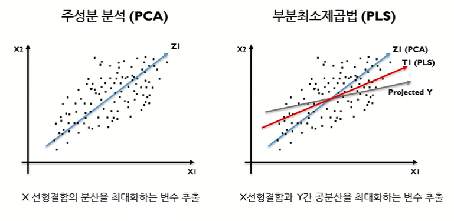

| PCA                                      | PLS                                              |
| ---------------------------------------- | ------------------------------------------------ |
| X 선형결합의 분산을 최대화하는 변수 추출 | X 선형결합과 Y간의 공분산을 최대화하는 변수 추출 |
| 비지도 방식                              | 지도 방식                                        |


[TOC]

## 1. PCA

> Principal Component Analysis 주성분분석 

**변동이 크게 되는 새로운 축을 주성분으로 하여 데이터의 차원을 줄이는 기법**

```
n개의 관측치와 p개의 변수로 구성된 데이터를 상관관계가 없는 k개의 변수로 구성된 데이터 (n개의 관측치)로 요약하는방법
```

- 원래 데이터의 분산을 최대한 보존하는 새로운 축을 찾고 그 축에 데이터를 사영시키는 방법 
- 2차원 데이터를 축에 사영시킬 경우 손실되는 정보의 양 (분산의 크기): `좌측 기저 > 우축 기저`

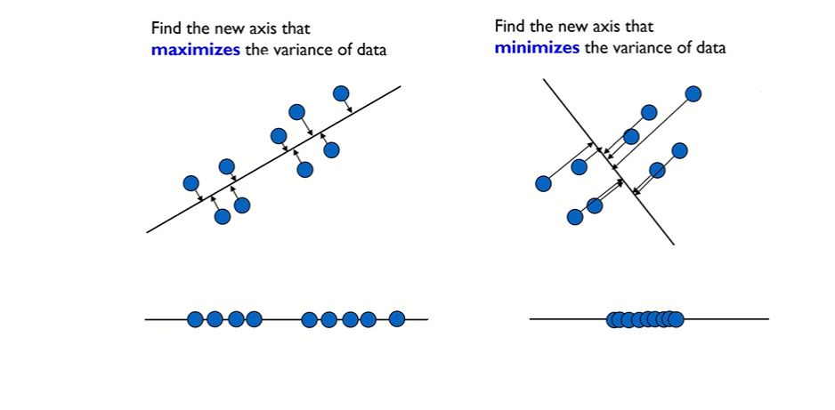

| 행렬 표현 (Vector & Matrix)                                  | 사영 (Projection)                                            |
| ------------------------------------------------------------ | ------------------------------------------------------------ |
| 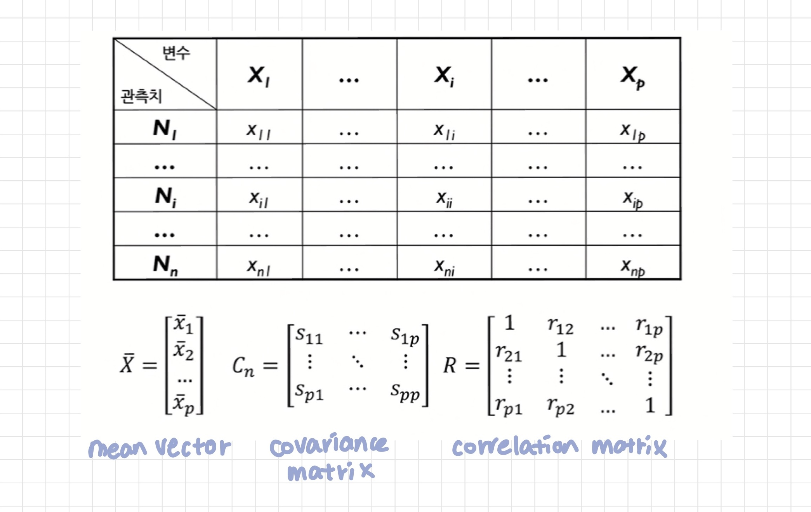 | 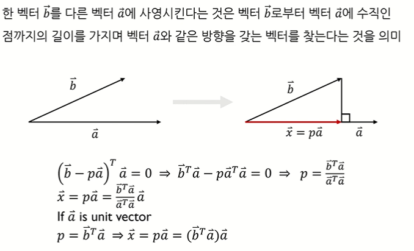 |


```
1. 데이터 정규화
2. 기존 변수의 covariance matrix 계산
3. covariance matrix로부터 eigenvalue와 eigenvector 계산
4. eigenvalue와 eigenvector를 정렬한 후 기존 변수를 변환
```

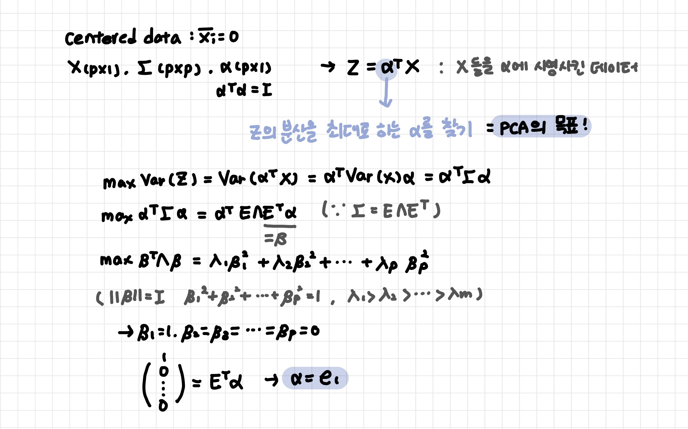

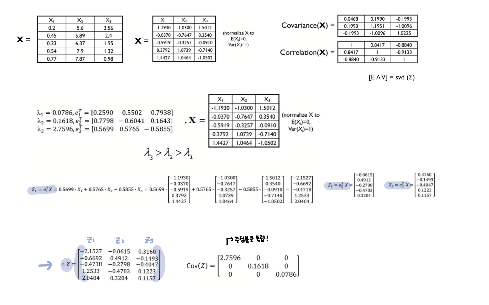

**주성분**

- 새로운 변수/요약된 변수: 설명변수 X를 가장 잘 나타내는 기존 변수의 선형 조합 

- 기존의 변수의 weighted sum으로 표현: 기존 독립변수 간의 상관관계가 있을 경우 효과 극대
- 서로 상관관계가 없도록 만들어진다 (uncorrelated, orthogonal)

- **주성분의 개수 선택**
  - 방법1: 고유값 감소율이 유의미하게 낮아지는 Elbow Point의 주성분 수 선택 
  - 방법2: 일정 수준 이상의 분산 비(70%이상)를 보존하는 최소의 주성분 수 선택

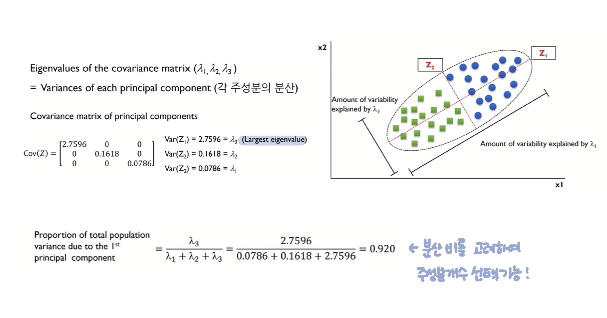

- 원 변수를 이용해서 새로운 변수를 만들기 때문에 정보의 손실없이 차원을 축소할 수 있다

- 새로운 변수 정의했기 때문에 문제의 원인 추론이 어렵다: 예측값에 Z1이 얼마나 영향을 미쳤는지는 알 수 있지만 X1, X2... 가 얼마나 영향을 미쳤는지 분석하기 어렵다

- 다중공선성을 해결하거나, 예측 성능을 높이기 위해 주로 사용

<br>

---

<br>

## 2. PLS

> Partial Least Squares 부분최소제곱

**Y와의 공분산을 최대화하는 독립변수 X들의 선형결합을 새로운 변수로 추출하는 방법**

- 변수들의 선형결의 집합을 찾은 후 이러한 새로운 변수들을 이용한 최소제곱을 통해 선형모델을 적합 

- Y값을 고려하여(Y값의 분산 활용) 차원을 축소하는 방법
- 선형조합으로 추출된 변수가 설명하지 못하는 부분에 지속적으로 최소제곱법을 사용하는 것

| 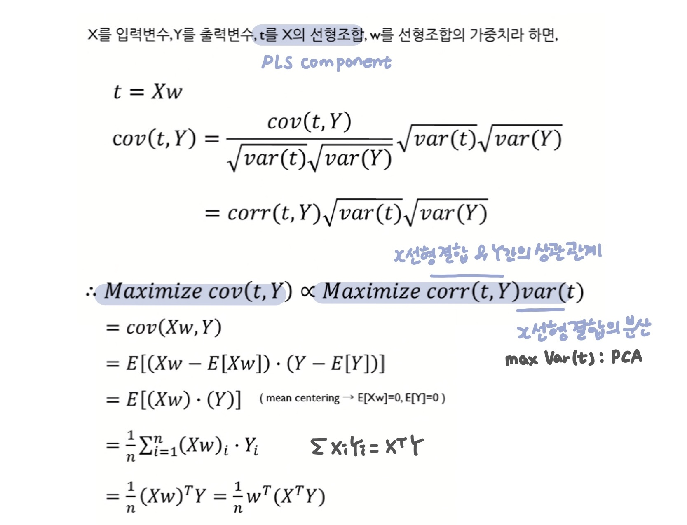 | 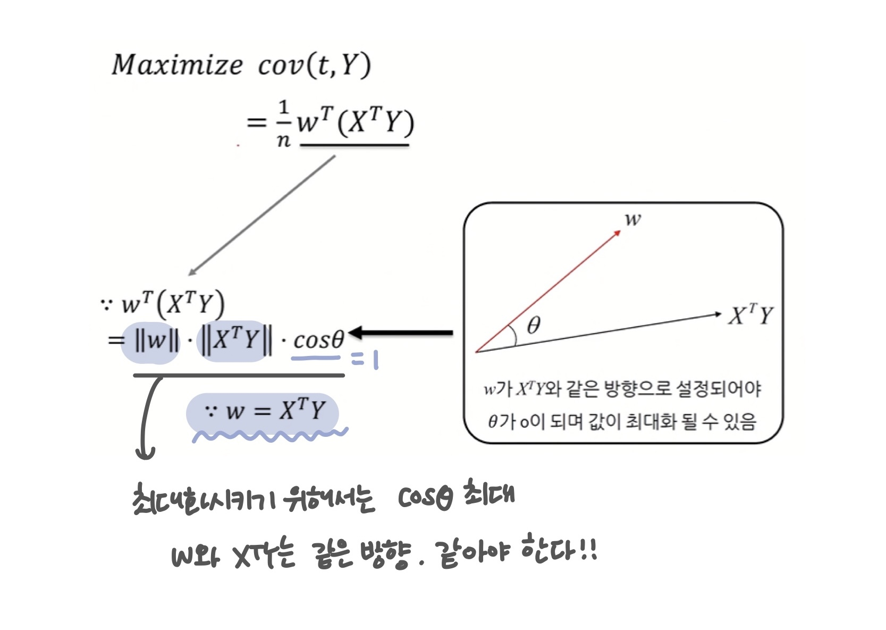 |
| ------------------------------------------------------------ | ------------------------------------------------------------ |

<br>

**NIPALS (Nonlinear Iterative Partial Least Squares)**

| 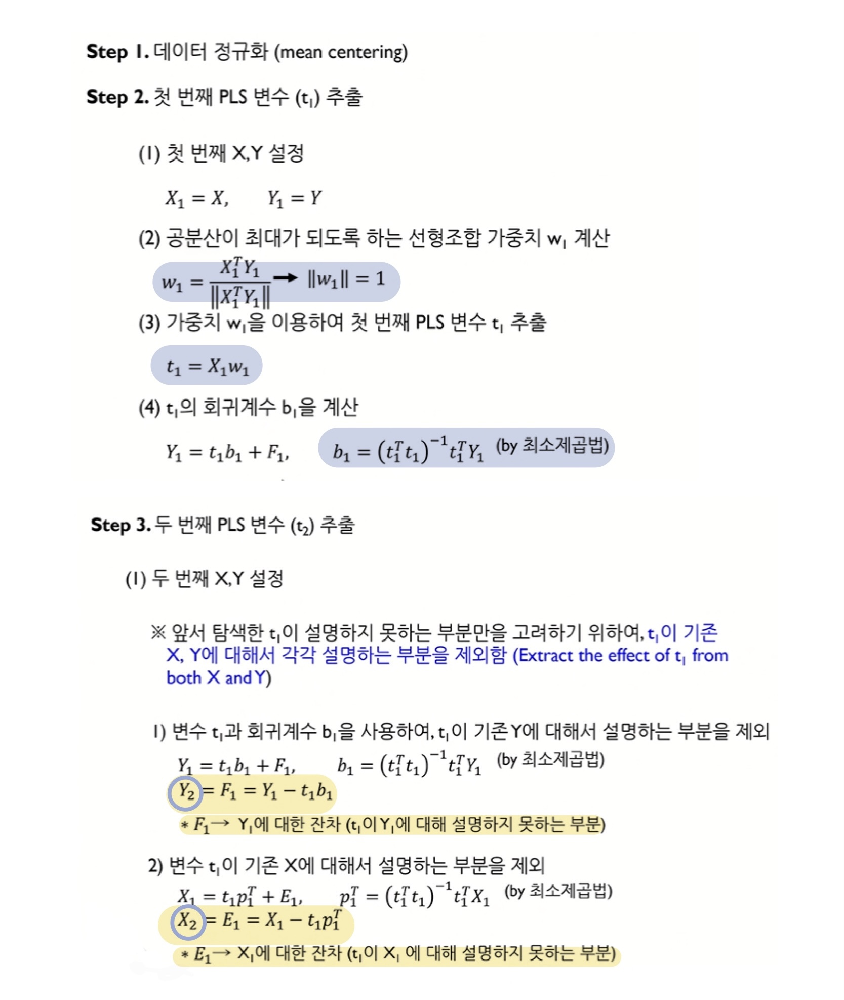 | 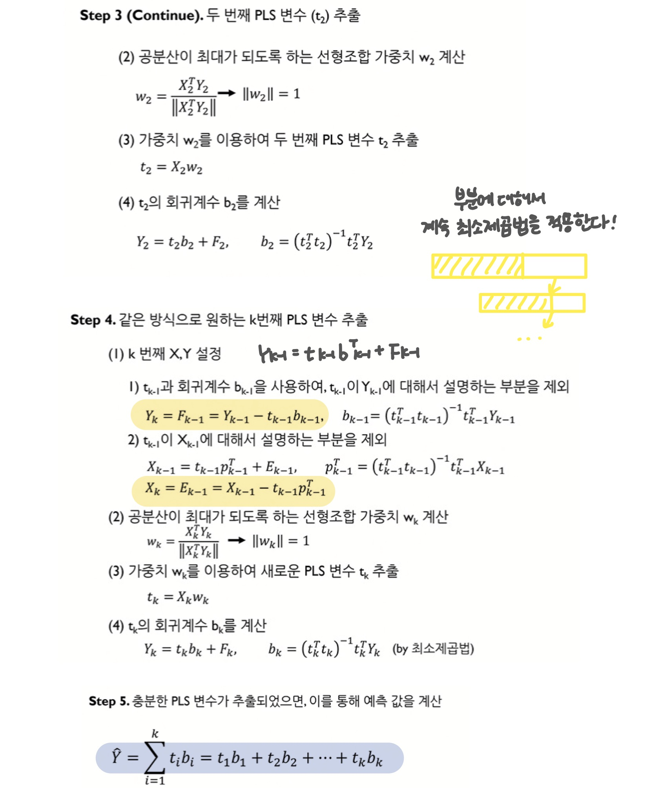 |
| ------------------------------------------------------------ | ------------------------------------------------------------ |

**추출 변수**

- Latent Variable(잠재변수)
- 변수 중요도 VIP (Variable Importance in Projection)
  - `추출 변수의 분산 x 추출변수와 원변수의 상관성의 제곱`
  - VIP가 1보다 크면 해당 변수가 중요하다고 판단 

- **추출 변수의 개수 선택**: k를 순차적으로 증가시키면서 가장 좋은 예측 결과를 보이는 k를 선택

<br>

- 지도식 방식: 종속변수인 Y값을 고려

- 편향을 줄일 수 있지만 반면에 분산을 증가시킬 가능성이 있다.

- PCA가 반영하지 못했던 Y와의 상관관계를 반영할 수 있다

- 적은 수의 추출 변수로 효율적인 모델 구축 가능
- PLS 확장 모델: 출력변수 Y가 여러 개일 때, 출력변수 Y가 범주형일 때 PLS-DA

<br>

---

[참고 및 출처 영상1](https://www.youtube.com/watch?v=FhQm2Tc8Kic) / [참고 및 출처 영상2](https://www.youtube.com/watch?v=OCprdWfgBkc)
