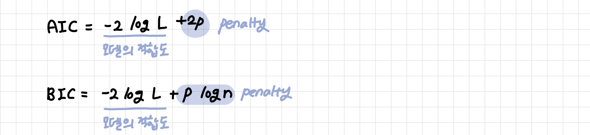

# Feature-Selection

변수선택: 주어진 변수 중 모델의 설명 변수로 사용할 변수를 선택하는 과정으로 F 통계량이나 AIC를 사용해 변수를 하나씩 택하거나 제거하는 방법

| 변수 선택 (selection) (✔)                             | 변수 추출 (extraction)                                       |
| ----------------------------------------------------- | ------------------------------------------------------------ |
| 분석 목적에 부합하는 소수의 예측 변수만을 선택        | 예측 변수의 변환을 통해 새로운 변수 추출                     |
| 선택한 변수 해석 용이<br>변수 간 상관관계 고려 어려움 | 변수 간 상관관계 고려, 변수의 개수를 많이 줄일 수 있다<br>추출된 변수의 해석이 어려움 |

[TOC]

**모델의 성능지표**

변수의 개수 p가 커지면 Bias(RSS) 🔽 Variance 🔼 → 우도 Likelihood를 가장 크게 하면서 변수의 개수 p는 가장 적은 모델

- **Mallows Cp**
  - p와 비슷한 경우: Bias가 작고 우수한 모델
  - p보다 큰 경우: Bias가 크고 추가적인 변수가 필요한 모델
  - p보다 작은 경우: 필요없는 변수가 있는 모델 (Variance 증가폭 < Bias 감소폭)


- **AIC**(Akaike information criterion): 작을수록 우수
- **BIC**(Bayesian information criterion): 작을수록 우수



- **수정된 R제곱**: 1에 가까울수록 모델의 설명도 높음


**모델 적합의 수치적 측도**: RSE와 R제곱


<br>

---

<br>

## 1. 최상의 부분집합 선택법

> Best Subset Selection

**가능한 모든 모형을 고려하여 가장 좋은 모델을 선택**

- 비교기준에 따라 최선의 모형을 선택

- 절약모형 (parsimonious model): 변수의 수를 고려한 비교에 의해 간단한 모형을 찾는다

- 변수의 수가 많으면 계산량이 매우 많아진다

```
1. M0: null model
2. k = 1, 2, ..., p에 대해 k개의 설명변수를 포함하는 모든 pCk개의 모델 적합
3. pCk개의 모델 중 최고의 모델을 골라 Mk
4. M0, ..., Mk 중 최고의 모델 하나 선택
```

<br>

---

<br>

## 2. 전진 선택법

> Forawrd Selection

**설명변수가 하나도 포함되지 않은 모델에서 하나씩 설명변수를 추가하며 성능지표를 비교하는 방법**

- 절편만 있는 모델에서 기준 통계치를 가장 많이 개선시키는 변수를 차례로 추가
- 표본의 수 n < 설명변수의 수 p인 경우에도 사용 가능
- 장점: 최상의 부분집합 선택 비해 훨씬 적은 수의 모델을 고려한다는 계산적 장점
- 단점: 선택된 설명변수는 절대 제거되지 않고 중요한 변수가 모형에 진입하지 못할 수도 있다

```
1. M0: null model
2. k = 1, 2, ..., p-1에 대해 Mk개에 하나의 설명변수를 추가한 모든 p-k개의 모델 고려
3. p-k개의 모델 중에서 최고를 골라 MK+1
4. M0, ..., Mp 중 최고의 모델 하나 선택
```

```
1. 고려된 변수 중 SSR(Xi)이 가장 높고 유의하면 변수를 선택한다
2. 이미 선택된 설명변수(Xi)의 설명부분 SSR을 제외한 SSR의 증가분 SSR(Xj|Xi)이 가장 크고 설명력이 유의한 경우 Xj 선택
3. 이미 선택된 설명변수(xi, Xj)의 설명부분 SSR을 제외한 SSR의 증가분 SSR(Xl|Xi, Xj)이 가장 크고 설명력이 유의한 경우 Xl 선택
4. 유의한 설명변수가 없을 때까지 반복
```

<br>

---

<br>

## 3. 후진 제거법

> Backward Elimination

**모든 설명변수가 포함된 모델에서 기준 통계치에 가장 도움이 되지 않는 변수를 하나씩 제거하며 성능지표를 비교하는 방법**

- 유의하지 않은 독립변수들을 계속 제거
- 표본의 수 n > 설명변수의 수 p: 완전모델 적합이 가능해야한다

```
1. M0: null model
2. k = p, p-1, ..., 1에 대해 Mk개에 하나의 설명변수를 제외한 모든 k개의 모델 고려
3. k개의 모델 중에서 최고를 골라 Mk-1
4. M0, ..., Mp 중 최고의 모델 하나 선택
```

```
1. 고려된 설명변수를 모두 삽입한 후 설명변수 중 가장 유의하지 않은 설명변수를 제거
2. 모든 설명변수가 유의할 때까지 반복
```

<br>

---

<br>

## 4. 단계적 선택

> Stepwise Selection

- 전진 선택법 + 후진 제거법
- 모든 변수가 포함된 모델 / 절편만 포함된 모델에서 출발
- 기준 통계치에 가장 도움이 되지 않는 변수를 삭제 / 빠져 있는 변수 중에서 기준 통계치를 가장 개선시키는 변수 추가
- 중요한 변수가 모형에서 제외될 가능성이 적지만 한 번 제외된 변수는 다시 선택되지 못한다

```
1. 고려된 설명 변수 중 설명력 SSR(Xi)이 가장 높고 설명력이 유의하면 변수 선택
2. 이미 선택된 설명변수의 설명부분을 제외한 SSR(Xj|Xi)이 가장 크고 설명력이 유의한 경우 Xj를 선택
3. 새로 선택된 변수의 설명부분을 제외한 부분에 대해 이미 존재한 설명변수의 유의성을 검정하여 유의하지 않으면 제외 / 유의하면 계속 넣고 다음 단계
4. 다시 이미 선택된 변수를 제외하고 다른 변수들 중 가장 SSR의 증가분이 높은 변수를 유의성 검정에 의해 유의하면 변수 추가
5. 유의한 설명변수가 존재하지 않을 때까지 반복
```
