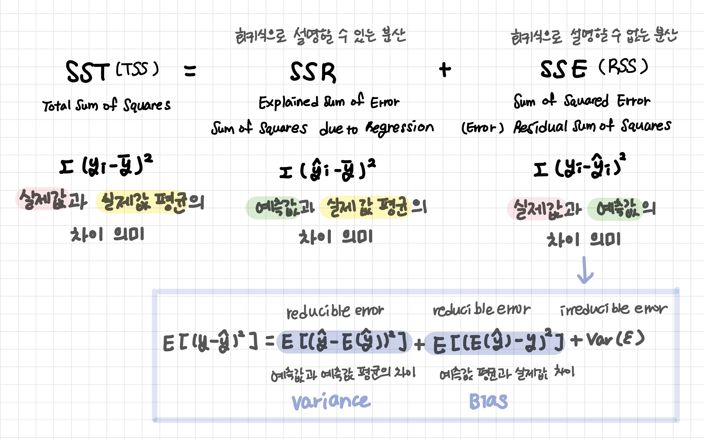
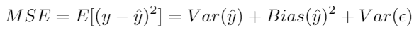
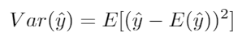
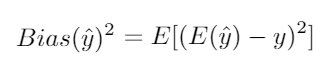
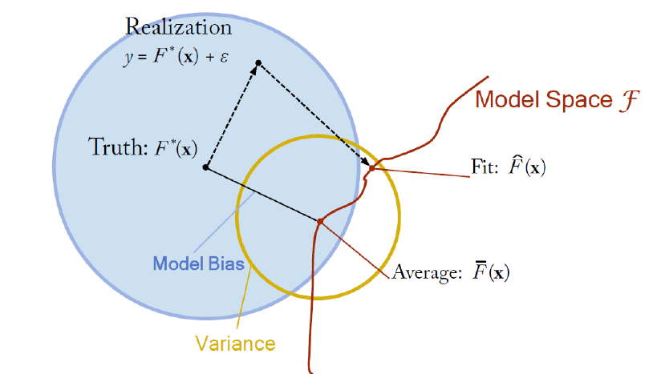

# 선형회귀

[TOC]

종속 변수(응답 변수) y와 한 개 이상의 독립 변수 (설명 변수) X와의 선형관계를 모델링하는 회귀분석

- 단순회귀분석(Simple Regression Analysis)
- 다중회귀분석(Multi Regression Analysis)




<br>

## 1. 회귀모형 진단

**선형회귀 조건**

```
모형의 선형성, 오차의 등분산성/정규성/독립성, 설명변수 간의 독립성

- 결측값, 중복값 처리
- 설명변수 간 다중공선성: 산점도, 상관계수, 분산팽창지수
- 설명변수 표준화, 척도 변환
- 질적 설명 변수: 더미변수 사용
```

**잔차(residuals)**: 남아있는 오차, 추정 회귀식이 반응변수 관찰치를 설명하지 못하는 부분

- 잔차 산점도 (Residual Plot)를 그렸을 때 평평한 띠 모양
- 오차항에 대한 가정 검토: 독립성, 정규성, 등분산성

<br>

### 1-1. 모형의 선형성

> 독립변수와 종속변수는 선형관계이다

- 진단
  - `잔차 산점도`가 선형인지 확인
  - `잔차 그래프(Residuals vs Fitted values)`에 패턴이 존재한는지 확인
- 처방: 비선형회귀모형을 설정하거나 log, 루트, 제곱변환 등 설명변수 X들을 변수변환하여 선형이 되도록 한다

<br>

### 1-2. 오차의 등분산성

> 오차항은 평균이 0이고 분산이 일정한 정규분포를 갖는다 

오차의 비상수 분산 또는 이분산성

- 진단: `잔차 산점도` (표준 잔차)에서 띠 모양, 깔때기 모양이 나오는지 확인
- 처방: 등분산이 되도록 log, 제곱근과 같은 오목함수를 사용하여 반응변수Y를 변환하나 이분산을 고려한 모형으로 바꾸기

<br>

### 1-3. 오차의 정규성

> 오차항은 평균이 0이고 분산이 일정한 정규분포를 갖는다 

- 진단: 잔차의 히스토그램, 줄기잎그림을 그려 정규 분포 모양인지 확인
- 정규성 검정
  - `Shapiro-Wilk` W 통계량
  - `Normal Q-Q plot`
- 처방: 변수변환 하기

<br>

### 1-4. 오차의 독립성

> 오차항은 자기 상관성이 없다

오차항들의 상관성: 추정된 표준오차는 실제 표준오차를 과소추정하는 경향이 생기고 실질적인 신뢰구간과 예측구간은 계산된 수치보다 더 좁을 것

- 진단: Durbin-watson 통계량

<br>

### 1-5. 설명변수 간의 독립성 (다중공선성)

> 설명변수들은 서로 선형적으로 독립이다 

**다중공선성 (Multicollinearity)**: 독립변수들이 강한 선형관계를 가지고 있는 상태

- y를 설명하는 X들의 변동성은 제곱합 형태이기 때문에 변수가 추가될수록 **변동성**이 커진다
  - F 검정이 귀무가설을 기각될 가능성이 커지면서 R-Squared가 커진다
  - F 검정 결과와 R-Squared의 신뢰성이 떨어진다 (가설검정의 능력 감소)

```
- X변수 중 하나와 다른 X 변수들의 선형결합이 매우 높은 상관관계에 있을 때 
- X변수들 사이의 선형 독립성이 성립하지 못한 상태
```

- 진단
  - `분산팽창인수 VIF` 확인: 공선성이 없을 경우 1, `5또는 10`을 초과하면 공선성이 있다고 볼 수 있다
  - `산점도 행렬` 또는 `설명 변수끼리의 산점도`에서 선형관계를 보이는 경우
  - 설명 변수를 뺄 때와 추가할 때 다른 설명변수들의 기울기 추정값들이 많이 변동하는 경우
- 처방
  - 상관계수가 가장 높은 문제가 되는 X변수를 제거: 해당 변수가 반응변수에 대해 제공하는 정보가 다른 변수들과 중복된다는 것을 의미하기 때문
  - 공선성 변수들을 단일 설명변수로 결합
  - 주성분 분석 PCA, 요인분석, VAE 등의 알고리즘을 이용한 차원 축소
  - 모수 추정시 최소자승법 대신 regularization 부여 Ridge, Lasso 등

<br>

### 1-6. 이상치 여부

> 데이터에 아웃라이어가 없어야한다

**이상치 (Outlier)**: 주어진 회귀 모델에 의해 잘 설명되지 않는 데이터 점들 -> 이상치는 RSE를 극적으로 높게 만들 수 있다

**스튜던트화 잔차 (Studentized Residual)**: 잔차를 잔차의 표준편차로 나눈 값

- 진단
  - `잔차`로 이상치 식별
  - `스튜던트화 잔차` (각 잔차를 추정표준오차로 나누어 계산)의 절대값이 3보다 큰 관측치
  - `본페로니 교정 (Bonferroni correction)`: 다중 비교에서 검정하는 가설의 숫자가 늘어나면 귀무가설이 기각될 확률이 낮더라도 기각될 가능성 더욱 늘어나게 된다. 귀무가설이 참임에도 불구하고 기각하는 제1종 오류를 보정하기 위해서 여러 개의 가설들에 대해서 최소한 하나의 제1종오류가 발생할 가능성을 계산해 보정할 수 있다. 

```
스튜던트화 잔차는 t분포를 따르므로 t-test를 사용해 rstudent() 값이 너무 크거나 작은 점을 찾기: Bonferroni p < 0.05인 이상치 검출
```

- 처방: 입력 실수인지 확인, 이상치를 그대로 포함할지, 제거한 후 선형 모형을 적용할지 확인

<br>

### 1-7. 영양관찰치 여부

**영향관찰치**: 레버리지가 높은 (영향력이 큰) 이상치

- 진단

  - 영향력을 판단하기 위해 제거한 후 모형을 추정하고 추정치 값들과 R2가 얼마나 차이나는지 확인

  - 레버리지 통계량 확인

    

  - `1/n과 1 사이의 값`, 평균 레버리지는 항상 `(p+1)/n` 

  - 이보다 큰 레버리지 통계량을 가지는 점은 이상치라고 볼 수 있다

- 처방: 입력 실수인지 확인

<br>

### 1-7. 설명변수와 오차항 독립

설명변수와 오차항은 서로 독립이다

<br>

---

<br>

## 2. 공분산과 상관 계수

### 2-1. 공분산

> Covariance

**선형 관계의 방향(Direction)**

관계의 강도는 알 수 없다: 공분산이 측정단위의 변화에 영향을 받기 때문

| Cov(Y, X) > 0 | Cov(Y, X) < 0 |
| ------------- | ------------- |
| 양의 상관관계 | 음의 상관관계 |

<br>

### 2-2. 상관 계수

> Pearson correlation coefficient

독립 변수와 종속 변수 간의 상관관계를 나타내는 척도

- 표준화된 변수들 사이의 공분산
- 두 변수들의 표준편차에 대한 공분산의 비: -1 ≤ Cor(Y, X) ≤ 1

**선형 관계의 방향(Direction)**

| Cor(Y, X) > 0 | Cor(Y, X) < 0 |
| ------------- | ------------- |
| 양의 상관관계 | 음의 상관관계 |

**선형 관계의 강도(Strength)**

`Cor(Y, X) = 0` != `관계가 없다 (선형 관계가 없다는 뜻일 뿐!)`

| Strong            | Moderate          | Weak              |
| ----------------- | ----------------- | ----------------- |
| 0.7 ≤ \|r\| ≤ 1.0 | 0.3 ≤ \|r\| < 0.7 | 0.0 ≤ \|r\| < 0.3 |

<br>

---

<br>

## 3. 질적 설명변수

**가변수(Dummy Variable)**: 질적 변수를 통계분석을 위해여 0과 1로 지정한 변수


> 범주형 변수 Species를 2개의 가변수를 사용하여 표현
>
> Species 별로 세 가지 모델을 만든 것과 같다

| Species    | Speciesversicolor | Speciesvirginica |
| ---------- | ----------------- | ---------------- |
| setosa     | 0                 | 0                |
| versicolor | 1                 | 0                |
| virginica  | 0                 | 1                |

<br>

---

<br>

## 3. 회귀 모형 구축

- 설명모형(Explanatory Model): 종속변수와 독립변수들 간의 관계를 설명
  - 데이터가 적은 모형
  - 변수 간의 관계를 잘 설명할 수 있는 최상의 적합모형을 추정

- 예측모형(Predictive Model): 새로운 데이터에 대한 결과값 예측
  - 데이터가 충분히 많은 모형
  - 적합된 모형을 이용하여 새로운 데이터 예측
  - Training data(모형추정)와 Test data(모형성능 평가)로 나뉘어 분석

<br>

### 3-1. 최소제곱법 OLS

> 최소자승법: Least Square Estimation Method, OLS (Ordinary Least Squares)

어떤 데이터가 주어졌을 때 최적의 추세선을 그리기 위한 방법 

```
회귀식의 기울기와 절편을 구하는 방법
```

- 잔차의 제곱합(RSS: Residual Sum of Square)을 최소로 하는 방법

- 잔차의 제곱합을 편미분하여 연립 방정식을 푸는 방법

- **잔차(Residual)  = Loss**: 실제 데이터의 y값(실제값)과 회귀직선의 y값(예측값)의 차이

<br>

### 3-2. 경사하강법

> Gradient Descent

어떤 함수값을 최소화하기 위해 임의의 파라미터 (시작점)을 정하고 조금씩 변화시켜가며 Loss를 점점 줄여가는 방법으로 최적의 파라미터를 찾는 방법

```
loss를 최소화하는 최적의 기울기와 절편을 구하는 방법
```

- 그래디언트 gradient: 특정 시점에서의 기울기 (미분)
- 해당 지점에서의 그래디언트(경사)를 구하고 그래디언트의 반대 방향으로 조금씩 이동하는 과정 반복

- Loss가 가장 크게 감소하는 방향으로 기울기`w` 과 절편 `b` 를 이동시키는 것

- **Convergence**: Loss의 변화가 거의 없는 iterations 지점

- **Learning rate**: 한 step에서 gradient가 변화하는 양
  - 너무 작은 learning rate: converge까지 많은 시간 소요
  - 너무 큰 learning rate: 가장 적은 loss값을 지나쳐 발산하는 경우 발생

<br>

### 3-3. 다른 적합 절차

```
서브셋(부분집합) 선택, 수축(shrinkage), 차원축소(Dimension Reduction)
```

- 예측 정확도: n이 p보다 아주 크지 않으면 최소제곱적합에 많은 변동이 존재할 수 있어 과적합을 초래할 수 있다. p>n가 되면 분산이 무한대가 되어 최소제곱 방법은 전혀 사용할 수 없게 된다!
- 모델 해석력: 최소제곱방법으로 반응 변수와 관련이 없는 변수들이 0이 되도록 계수 추정치를 얻기 힘드므로 관련 없는 변수들을 제외하는 기법들이 필요

<br>

---

<br>

## 4. 회귀계수

> coefficient

회귀계수에 대한 검정

- 단순선형회귀: 1개의 회귀계수가 0인지 **t-test 가설검정**
- 다중선형회귀: p개의 모든 회귀계수들이 0인지 **F-test 가설검정**

```
- 귀무가설: 회귀계수는 0이다 ▶ 변수의 설명력이 없다
- 대립가설: 회귀계수는 0이 아니다 ▶ 변수의 설명력이 있다
```

<br>

---

<br>

## 5. 분산과 편향

> 지도학습에서의 공통 이슈!!



| Variance 분산                                                | Bias 편향                                                    |
| ------------------------------------------------------------ | ------------------------------------------------------------ |
| reducible error                                              | reducible error                                              |
| 예측 값이 예측값의 평균에서 얼마나 퍼져있는지<br>데이터를 넣어 나오는 예측값의 변동성 | 예측값의 평균과 실제값의 차이<br>데이터를 넣어 나오는 예측값이 실제값을 얼마나 정확하게 예측하는지 |
|                               |                               |

**Var(ε)**: irreducible error 데이터 자체가 갖는 오차 (노이즈)

<br>

### 5-1. trade-off


|  |                     |
| -------------------------------------- | ------------------------------------------------------------ |
| **분산이 커지면**                      | 예측값이 예측값 평균으로부터 퍼져있게 된다<br>(자기들끼리 모여있는 정도) |
| **편향이 커지면**                      | 예측값 평균이 실제값으로부터 떨어지게 된다<br>(실제값과 비슷한 정도) |

[참고영상](https://www.youtube.com/watch?v=uyTFqesUfqY) / [참고 문서](http://scott.fortmann-roe.com/docs/BiasVariance.html)

<br>

### 5-2. 과소/과대 적합

|                                              |  |
| -------------------------------------------- | ------------------------------------------------------------ |
| 모델이 간단하면<br>**과소적합 Underfitting** | **분산 🔽**: 예측값의 변동성이 적어 분산이 작아진다 <br>**편향 🔼**: 예측값 평균과 실제값 거리가 멀어지며 편향은 커진다<br>훈련이 너무 덜 되어 실제값을 잘 예측하지 못한다 |
| 모델이 복잡하면<br>**과대적합 Overfitting**  | **분산 🔼**: 예측값의 변동성이 커져 분산이 커진다 <br>**편향 🔽**: 예측값 평균과 실제값 거리가 좁아져 편향이 작아진다<br>훈련이 너무 심하게 되어 새로 제시되는 데이터에 변동성이 커진다 |

최선은 전체 오차(Total Error = Variance + Bias²)를 최소화하는 선에서 분산과 편향이 서로 적절히 양보한 모델

독립 변수간 상관관계가 높으면 종속 변수의 변화가 어떤 독립변수에 의해 나타나는지 정확한 계수 값을 알기가 어려워집니다. 즉, 계수 예측값의 분산이 커지는 것이죠. 이때 예측값 간의 차이인 분산이 지나치게 커지지 않도록 다양한 규제 방법(L1 규제, L2 규제 등)을 사용

<br>

### 5-3. 해결방법

**Bias 줄이는 방법 (과소적합을 막기 위한 방법)** : 부스팅 (Boosting)

**Variance 줄이는 방법 (과적합을 막기 위한 방법)**

- 데이터의 개수를 늘린다

- [정규화 기법 Regularization](./Regularization): 가중치 규제
  - Ridge (L2 Regularization): 회귀계수가 삭제되는 것이 아니라 매우 작은 값
  - Lasso (L1 Regularization): 오차와 함께 회귀계수의 절대값도 함께 최소화하는 목적함수
  - Elastic Net
- Feature의 개수를 줄인다 - 차원의 저주 Cause of Dimensionality
  - [변수 선택](./변수선택): 전체 독립변수에서 유효하다고 판단되는 독립변수를 뽑아내는 것
  - [차원 축소](./차원축소): 기존의 독립변수로부터 완전히 새로운 변수를 추출
    - PCA 주성분 분석, PLS

<br>

---

<br>

## 6. 그래프

**Residuals vs Fitted plot**

- X축 - 선형 회귀로 예측된 Y값, Y축 - 잔차

- 0에서 멀리 떨어진 값: 이상치 가능


<br>

**Normal Q-Q plot**


<br>

**Scale-Location plot**

- X축 - 선형 회귀로 예측된 Y값, Y축 - 표준화 잔차
- 0에서 멀리 떨어진 값: 이상치 가능


<br>

**Residuals vs Leverage plot**

- X축 - 레버리지, Y축 - 표준화 잔차

- 레버리지: 설명변수가 얼마나 극단에 치우쳐 있는지


<br>

**쿡의 거리 Cook's distance**

회귀 직선의 모양에 크게 영향을 끼치는 점들을 찾는 방법으로, 레버리지와 잔차에 비례 (우측 상단, 우측 하단)


<br>

**Cook's dist vs Leverage**


