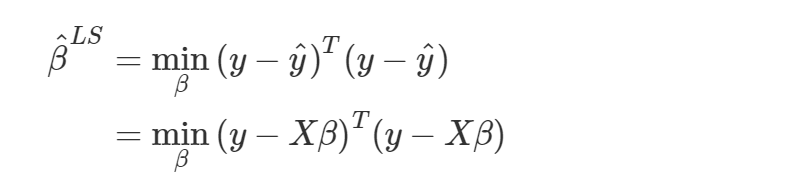
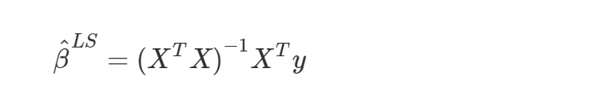
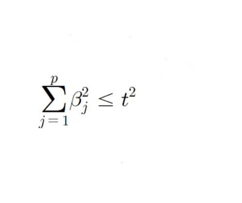
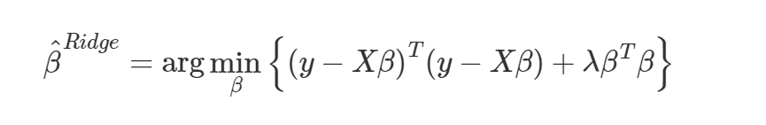
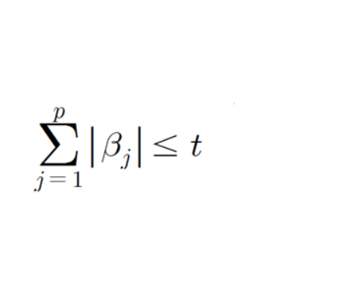
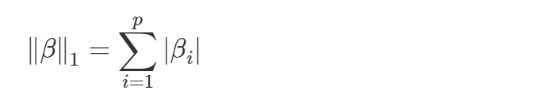

# Regularization

> 정규화

[TOC]

**선형회귀 모델에서 도출된 회귀계수들에 제약을 가하여 과적합을 방지하고 모델의 일반화 성능을 높이는 방법론**

- 영향력 없는 입력 변수의 계수를 0에 가깝게 하여 입력 변수의 수를 축소하는 방법 → 노이즈를 제거하여 모형 정확도 개선, 다중공선성 문제 해결
- Bias를 어느 정도 허용하면서 variance를 줄이는 방법: 학습데이터에 대한 설명력을 포기하는 대신 미래 데이터에 대해 상대적으로 안정적인 결과

- 계수 추정치를 제한(constrains)하거나 규칙화(regularizes)하는 기법

 

일반적인 선형 회귀 방법: 최소자승법(Least Squares Method)을 통해 종속변수의 실제값과 모델의 예측값 사이의 평균제곱오차(Mean Square Error)를 최소화하는 회귀계수

**Best Linear Unbiased Estimator(BLUE)**: bias가 없는 추정량 가운데 variance가 가장 작은 추정값

 

|                    | Ridge                                                        | Lasso                                                        |
| ------------------ | ------------------------------------------------------------ | ------------------------------------------------------------ |
| 추가적인 제약 조건 | 가중치들의 제곱합을 최소화하는 것                            | 가중치의 절대값의 합을 최소화하는 것                         |
|                    | L2 규제 (L2 Regularization)                                  | L1 규제 (L1 Regularization)                                  |
| λ 커지면           | β가 0에 가까워진다                                           | β가 0이 된다                                                 |
| 변수 개수          | 모든 변수들을 포함 (변수 선택 불가능)                        | 최소한의 변수 포함 (변수 선택 가능)                          |
| 다중공선성         | 다중공선성 해결 효과 높음 변수 간 상관관계 높아도 좋은 성능 | 다중공선성 해결 효과 낮음 변수 간 상관관계 높으면 성능 저하 |
| 특징               | 크기가 큰 변수를 우선적으로 줄인다                           | 비중요 변수를 우선적으로 줄인다                              |

**Norm**: 두 벡터 사이의 거리를 나타내는 방법

- **L2 Norm (L2 Regularization)**: `각 가중치 제곱의 합`에 규제 강도(Regularization Strength) λ를 곱한다.
  - λ를 크게 하면 가중치가 감소 (규제의 중요도 🔼)
  - λ를 작게 하면 가중치가 증가 (규제의 중요도 🔽)

- **L1 Norm (L1 Regularization)**: `가중치의 합을 더한 값`에 규제 강도(Regularization Strength) λ를 곱하여 오차에 더한다.
  - 어떤 가중치(w)는 실제로 0이 되어모델에서 완전히 제외된다

 

**하이퍼파라메터 λ**: 제약을 얼마나 강하게 걸지 결정하는 값 → 수축 패널티

- λ = 0: 일반적인 선형 모형 (OLS)
- λ 크게 하면: 정규화 패널티 정도가 커지므로 β의 값들이 작아진다
- λ 작게 하면: 정규화 패널티 정도가 작아지므로 β의 값들이 커질 수 있다

 

---

 

## 1. Ridge 회귀

> 능형 회귀

**평균제곱오차를 최소화하면서 회귀계수 벡터 β의 L2 Norm을 제한하는 기법**

 

### 1-1. 제약조건 L2 Norm

- 가중치들의 제곱합(squared sum of weights)을 최소화하는 제약 조건 추가
- 추정할 계수의 제곱을 더한 값이 최소가 되는 값
- `λ가 커지는 것 = t가 작아지는 것`

|  |  |
| ------------------------------------------------------------ | ------------------------------------------------------------ |

 

회귀계수 추정량을 구하는 최소제곱 방법에서 제약조건을 추가하고 라그랑주 승수법을 통해 방정식으로 바꾼 결과

 

- 회귀계수가 0을 갖지 않는다: 모든 변수들을 포함하려 하므로 변수의 수가 많은 경우 효과적이지 않으나 과적합 방지 가능

- 다중공선성이 존재할 경우 상관성이 높은 변수들이 많아도 유사한 크기의 계수를 갖도록 하여 영향력을 줄일 수 있다

 

---

 

## 2. Lasso 회귀

> Least Absolute Shrinkage and Selection Operation

**평균제곱오차를 최소화하면서 회귀계수 벡터 β의 L1 Norm을 제한하는 기법**

 

### 2-1. 제약조건 L1 Norm

- 가중치의 절대값의 합을 최소화하는 제약 조건 추가
- 추정할 계수의 절대값을 더한 값이 최고가 되는 값
- `λ가 커지는 것 = t가 작아지는 것`

|  |  |
| ------------------------------------------------------------ | ------------------------------------------------------------ |

 

회귀계수 추정량을 구하는 최소제곱 방법에서 제약조건을 추가하고 라그랑주 승수법을 통해 방정식으로 바꾼 결과

 

- 회귀계수가 0이 될 수 있다: λ가 충분히 클 경우 계수 추정치들의 일부를 정확히 0이 되게 할 수 있으므로 변수선택법으로 활용할 수 있다

- 다중공선성이 존재할 경우 성능이 떨어진다

 

---

 

## 3. Elastic Net

Ridge와 Lasso를 혼합한 (L1, L2-norm 패널티를 결합한) 방법

λ로 패널티를 부여하고 α라는 새로운 하이퍼파라미터로 L1, L2-norm 패널티를 추가적으로 조정하는 역할

- 변수 선택이 가능하다

* 변수 간 상관관계가 높아도 성능을 낼 수 있다
* 최적해를 찾기 힘들다
* 하이퍼 파라미터가 2개가 된다

 

---

[참고 영상](https://www.youtube.com/watch?v=pJCcGK5omhE) / [참고 문서](http://www.datamarket.kr/xe/index.php?mid=board_BoGi29&document_srl=7176&listStyle=viewer&page=9)
