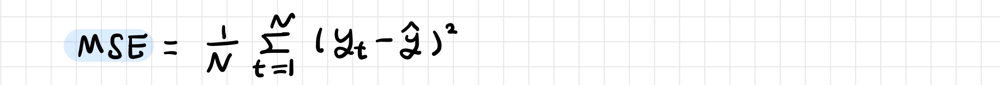
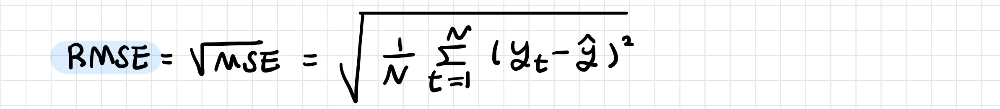
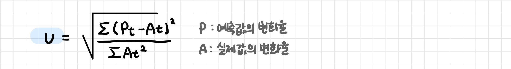

# 시계열 분석

> Time Series Analysis

[TOC]

## 1. 시계열 예측 

시간에 따라 순차적으로 관측된 데이터의 수열이 미래에 계속될 것인지

 

### 1-1. 시계열 예측 방법

**질적 예측 방법 (정성적인 예측)**: 미래 예측을 위해 주관적 견해 사용하는 방법

- 이용할 수 있는 데이터가 없는 경우

- 델파이 기법, 시나리오 기법

**양적 예측 방법 (정량적인 예측)**: 미래 예측을 위해 과거에 대한 양적 정보를 사용하고 예측에 필요한 경험적 법칙을 추정하는 방법

- 과거 수치 정보를 사용하거나 과거 패턴이 미래에도 계속될 것이라고 가정할 수 있는 경우

- 평활법과 분해법: 주어진 데이터를 잘 설명하는 것에 초점
- 확률적 시계열 분석: ARIMA, Fourier 분석

 

### 1-2. 시계열 예측 모델

**설명 모델 Explanatory Model**

- 예측 변수 predictor variable를 고려하는 모델

- 예측하려는 변수의 과거 값 뿐 아니라 변수에 관한 정보 포함

**시계열 모델 Time Series Model**

- 변수의 과거 값으로 미래를 예측하는 모델

- 변수의 영향 관계를 파악하기 어려울 때, 관심 있는 변수를 예측하려면 예측 변수의 미래값을 알아야할때

**혼합된 모델 Moxed Models**

- 변수의 과거값과 다른 변수들을 함께 고려하는 모델

- 동적회귀, 패널 데이터 모델, 종단적 모델, 수송함수 모델, 선형 시스템 모델 등

 

---

 

## 2. 예측 단계

**1. 문제 정의**: 예측값의 활용 방식을 고려하여 문제 정의

**2. 정보 수집**

- 통계 데이터: 과거 데이터, 부족한 경우에는 장의 판단 예측 기법

- 도메인 지식

**3. 탐색적 분석**: 데이터의 특징 확인

- 데이터를 그래프로 시각화
- 패턴, 추세, 계절성, 경기 순환, 특이점, 변수 사이의 관계 등

**3. 모델 선택 및 학습**: 가장 좋은 모델 선택 

- 과거 데이터의 활용 정도, 예측 변수와 설명 변수 사이의 관계 정도 등에 따라

- 회귀모델, 지수 평활 기법, Box-Jenkins ARIMA 모델, 동적 회귀모델, 계층적 예측, 신경망, 벡터 자기 회귀 기법 등

**4. 모델 예측**: 모델을 선택하고 매개변수를 추정한 후에 예측

 

---

 

## 3. 예측 평가

- 사전 평가와 모형 추정을 함께 진행

- 모형 추정을 진행하고 사전 평가를 시행

 

**평균제곱오차 (MSE)**

**평균제곱근오차 (RMSE)**

**평균절대오차 (MAE)**

**평균절대백분비오차 (MAPE)**

**타일의 불일치계수**

