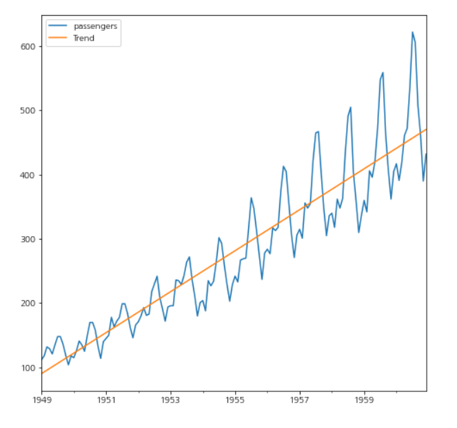
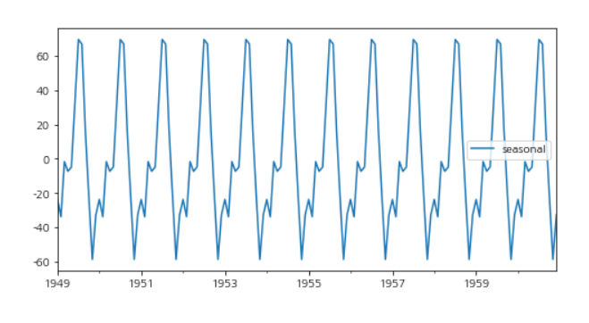
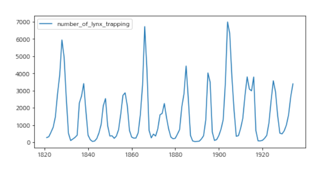

# 시계열 데이터

[TOC]

**시간에 따라 같은 시간 간격으로 혹은 불규칙적으로 관측된 데이터**

```
- Not Independent: 순차적으로 발생한 연속적인 관측치는 서로 관련 있다
- Not Identical Distributed: 시점 별로 얻어진 데이터의 확률분포가 다를 수 있다
- 시계열은 고정된 시간 구간의 관측치여야 한다
```

- 시계열 데이터: 시간에 따라 일정한 간격으로 모은 데이터
- 횡단면 데이터: 특정 시점에서 모은 데이터

<br>

## 1. 추세 

> Trend Variation: T

**시간에 따라서 증가하거나 감소하는 패턴**

- 선형추세 (선형함수), 곡선추세 (이차추세함수), 곡선추세 (이차추세함수), 곡선추세 (역추세함수)



<br>

## 2. 계절성

> Seasonal Variation: S

**주기적인 패턴을 갖고 반복적으로 나타나는 주기변동 **

- 일정한 빈도로 특정 주기를 기준으로 반복해서 나타는 패턴

- 빈도 Frequency: 계절성 패턴이 나타나기 전까지의 데이터 갯수

- 데이터 값이 다시 나타나는 시기를 어느 정도 특정 가능 (년, 월, 분기 등의 고정된 주기)
  - 단기에 나타나지 않고 장기에 걸쳐 나타난다
  - 추세변동과 함께 나타나는 경우가 많다



<br>

## 3. 순환

> Cyclical variation: C

**일정하지 않은 빈도로 발생하는 패턴**

- 특정 데이터 값이 시간이 지나 다시 나타나는 패턴
- 주기가 계절변동보다 크며 추기 자체가 시간의 흐름에 따라 변한다

- 데이터 값이 다시 나타나는 시기를 특정할 수 없다 (경기 변동: 장기간 상승, 하락이 주기적으로 반복되는 패턴): 추세를 중심으로 나타나지만 주기적인 것은 아니다



<br>

## 4. 불규칙 변동 

> Irregular Variation: I

**시간에 따른 규칙적인 움직임과 무관하게 랜덤하게 나타나는 변동 성분** 

- = 회귀모형의 오차항

- 승법 모형: 추세 * 계절 * 순환 * 불규칙 변동

- 가법 모형: 추세 + 계절 + 순환 + 불규칙 변동

<br>

## 5. 더미 변수 

> Dummy Variables

이진수의 형태로 변수를 생성하는 것

확실한 패턴이 존재하는 경우에만 효과가 있다

```
범주형 변수의 기준값을 미리 설정한다
기준값을 제외하고 더미변수를 생성한다
각 더미변수의 값을 0 또는 1로 채운다 (1은 각 더미변수의 정의)
```

<br>

## 6. 지연값

>  Lagged Values

변수의 지연된 값을 독립변수로 반영하는 것

- 시차, 시간에 따른 차이 반영: 어떤 데이터가 결과로 발생하는데 시간이 걸린다면 시간 정보를 반영하여 시점으로 옮기는 것

- ARIMA, VAR, NNAR등에서 활용