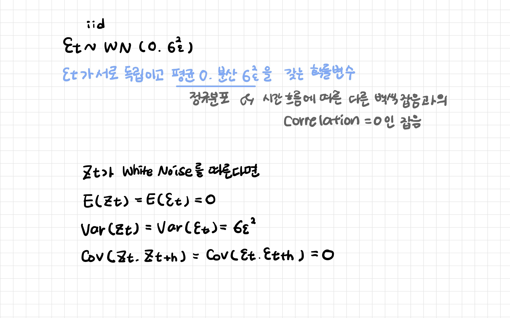

# 잔차진단

[TOC]

```
y = f(x) + e
```

- 검증지표는 수치로 나오지만 잔차진단은 시각화로 확인한다

-  잔차가 패턴이 없다면 f(x)가 y를 잘 적합했다고 판단할 수 있다: 잔차의 패턴이 없다는 것은 y와 f(x)가 유사하다는 의미!

<br>

## 1. 백색 잡음

> White Noise

패턴이 남아있지 않은 무작위한 변동: 백색잡음은 추세나 계절성이 남아있지 않다는 것을 의미한다



- 평균 0 과 일정한 분산을 가진 정규분포를 따라야한다
- 잔차들이 시간의 흐름에 따라 상관성이 없어야한다
  - 자기상관함수가 0인지 확인
  - 편자기상관함수 확인

<br>

---

<br>

## 2. 자기상관함수

> AutoCovariance Function

**시간에 따른 상관 정도를 나타내는 통계량**

**자기상관관계**: 현재의 상태가 과거와 미래에 밀접한 관련이 있는 관계

**자기상관도표 Correlogram**: 자기상관함수와 편자기상관함수 중 하나를 그래프로 표현한 것

- 어느 시점까지 데이터가 현재 시점에 영향을 주는지를 연산하는 함수: 동일한 변수를 시점을 달리하여 관측했을 때 시점에 따라 데이터 사이의 상호 연관관계가 나타나는지
- 시점 차이 lag 의 영향력 확인: 현 시점의 데이터와 시점 차이를 가지는 데이터를 비교하고 어떤 관계를 갖는지 확인

- AR, MA 모델 적합성에 필요한 함수 (절단값: 0으로 수렴하는 시점)


<br>

### 2-1. 자기상관함수

>  AutoCorrelation Funtion: ACF

**시차에 따른 자기상관: Zt와 Zt+k사이의 correlation 측정**

- k가 커짐에 따라 / 시차가 커짐에 따라 ACF(k)값은 작아진다
  - 정상시계열: 빠르게 0에 수렴
  - 비정상시계열: 천천히 감소

<br>

### 2-1. 편자기상관함수

> Partial Autocorrelation Functio: PACF

**시차에 따른 일련의 편자기상관: Zt와 Zt+k사이의 correlation 측정하되 t와 t+k 사이에 다른 y값들의 영향력을 배제하고 측정**

- 시차가 다른 두 시계열 데이터의 순수한 상호 연관성
- 시간의 효과 제거: 시간이 효과인 추세 제거!
- k 시간 다뉘로 구분된 시계열의 관측치 간의 상관 측도

<br>

---

<br>

## 3. 정상성 검정

**ADF 검정 Augmented Dickey Fuller Test**

```
H0: 데이터는 비정상성이다 (단위근이 존재한다)
H1: 데이터가 정상성을 만족한다 (단위근이 존재하지 않는다)
```

ARIMA 모형의 적분 차수 판단에 사용된다

- 검정 통계량 ADF Statistics가 Critical Value보다 작으면 정상성 시계열 데이터

- P-value가 신뢰수준 값보다 작으면 정상적 시계열 데이터 


https://en.wikipedia.org/wiki/Augmented_Dickey%E2%80%93Fuller_test


만약 δδ가 1이라면 이는 Unit root를 가지게 되는 것이고, 시간이 지남에 따라 시계열 데이터는 분산이 무한대로 커지게 됩니다. 따라서 위에 정리한 ADF test 검증모형에서 γγ는 0이 되면 시계열 데이터가 비정상성을 가진다고 볼 수 있습니다.

Python에서 statsmodels 패키지를 활용하여 쉽게 ADF Test를 수행할 수 있습니다.

<br>

---

<br>

## 4. 정규성 검정

**Shapiro Wilk Test**

```
H0: 데이터는 정규분포 형태이다
H1: 데이터는 정규분포 형태가 아니다
```

- 검정 통계량이 Critical Value보다 크면 정규분포 형태

- P-value가 신뢰수준 값보다 크면 정규분포 형태

<br>

---

<br>

## 5. 자기상관 검정

**Ljung Box Test**

```
H0: 시계열 데이터의 자기상관이 존재하지 않는다 (자기상관계수 = 0)
H1: 시계열 데이터의 자기상관이 존재한다 (자기상관계수 != 0)
```

- 검정 통계량이 Critical Value보다 크면 자기상관 존재하지 않음

- P-value가 신뢰수준 값보다 크면 자기상관 존재하지 않음

**Durbin Watson Statistic**

```
H0: 시계열 데이터의 자기상관이 존재하지 않는다 (자기상관계수 = 0)
H1: 시계열 데이터의 자기상관이 존재한다 (자기상관계수 != 0)
```

- 검정 통계량이 2에 근접: 시계열 데이터에 자기상관 존재하지 않음
- 검정 통계량이 0에 근접: 시계열 데이터에 양의 자기상관 존재
- 검정 통계량이 4에 근접: 시계열 데이터에 음의 자기상관 존재

<br>

---

<br>

## 6. 등분산성 검정

**Goldfeld Quandt Test**

```
H0: 시계열 데이터가 등분산이다
H1: 시계열 데이터가 등분산이 아니다
```

- 검정 통계량이 Critical Value보다 크면 등분산

- P-value가 신뢰수준 값보다 크면 등분산

