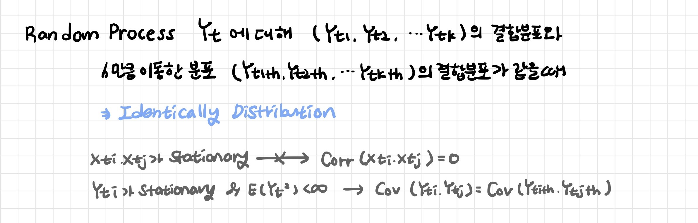
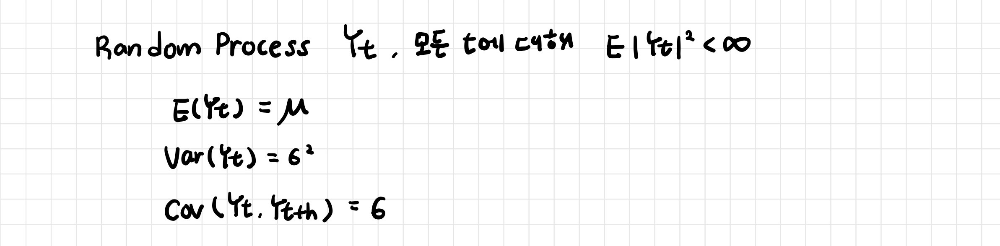
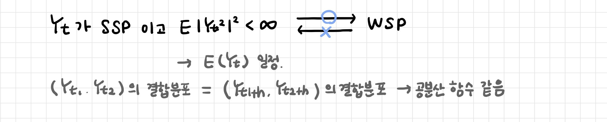
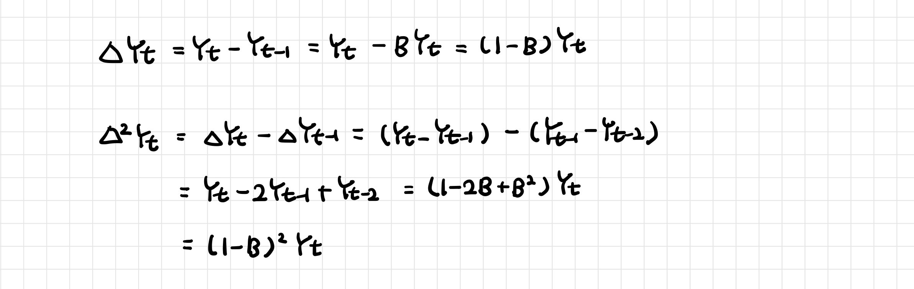

# 정상성

> Stationary

[TOC]

## 1. 정상성

**시간의 흐름에 따라 통계적 특성이 일정한 시계열**

- 시계열의 확률적 성질들이 시간에 흐름에 따라 변하지 않는다: 평균과 분산, 공분산 등의 모든 분포적 특징

- 주기성 행동을 가지고 있지만 불규칙적인 aperiodic 주기: 주기의 시작과 끝을 예측할 수 없다

- 자기 상관이 없고 등분산성이 있다
  - 등분산성 Homoscedasticity: 일정한 분산을 가진다 
  - 이분산성 Heteroscedasticity 발산하는 분산

```
- 시계열의 평균과 분산이 시점 t에 관계없이 일정하다
- 공분산은 두 시점의 시차에만 영향을 받는다
- 뚜렷한 추세나 계절성이 없다
- 변동이 일정하다
```


```
계절성: (d), (h) (i)
추세, 수준 변동:(a), (c), (e), (f), (i)
분산 증가: (i)
정상성: (b), (g)
```

- 정상성을 사용하는 이유
  - 데이터를 생성하는 확률 분포가 매시점 다르기 때문에 매 시점 하나의 데이터를 이용하여 평균 추정하게 되면 정확성이 떨어진다 → 기존 데이터분석에서 사용하는 통계량을 시계열 데이터에서도 사용하기 위한 조건 
  - 예측값이 무한대로 가지 않고 특정한 범위 내에서 안정적으로 예측 가능하다: 비정상 데이터에서는 범위가 무제한이지만 정상성 데이터에서는 범위가 제한되기 때문!
  - 과적합 방지 (적은 모수만으로 모델링 가능): 시계열이 정상성이 아니라면 시계열 데이터가 n개 일 때, 추정해야할 모수는 n개의 평균, n개의 분산으로 2n개가 된다 
  - 추세가 있는 경우 허구적 인과관계를 가질 수 있다

<br>

### 1-1. Strict Stationary

> 강정상성

변수들 간의 결합분포가 시점 t에 의존하지 않고 시차 h에 따라 정의된다



<br>

### 1-2. Weak Stationary

> 약정상성: Covariance Stationary, Wide Sense Stationary, Second order Stationary Process

기댓값과 분산이 특정 시점 t에 의존하지 않는 상수이며 공분산도 시점 t가 아닌 시차 h에 의존하여 정의된다



- 기대값이 시간에 따라 변하지 않는다

- 공분산 함수가 시간의 차이에만 의존한다



<br>

---

<br>

## 2. 정상성 변환

```
- 변동폭이 일정하지 않은 경우 → 로그 변환
- 추세, 계절성이 존재하는 경우 → 차분
```

<br>

## 2-1. 차분 

>  difference

**현 시점의 자료에서 전 시점의 자료를 빼는 것**

특정 시점의 데이터가 발산하는 경우 시점간의 차분 (변화량)으로 정상성 변환

2차차분으로도 정상적 시계열이 되지 않는 경우에는 변환 후 차분 진행



<br>

**일반차분 Regular Difference**: 바로 전 시점의 자료를 빼는 것

- 추세 추정 후 추세 제거를 통한 정상성 확보: 결정론적 기댓값 함수 알아내는 것
- 차분 적용 후 추세 제거를 통한 정상성 확보

**계절차분 Seasonal Difference**: 여러 시점 전의 자료를 빼는 것 

- 계절성: 특정한 달/요일에 따라 기대값이 달라지는 것
- 계절성 추정 후 계절성 제거를 통한 정상성 확보: 계절변수 더미화를 통해 기대값 함수 알아내는 것
- 차분 적용 후 계절성 제거를 통한 정상성 확보

<br>

### 2-2. 로그변환

**분산 안정화 변환으로 시점에 관계없이 분산이 동일하도록 변환**

- 시간 흐름에 비례하여 값이 커지는 경우: 분산 증가
- 표준 편차가 자료의 크기에 비례하여 증가하거나 지수함수적으로 증가하는 경우

<br>

### 2-3. Box-Cox 변환

정규분포가 아닌 데이터를 정규 분포로 변환

- 람다 == 0 이면: 자연로그 사용
- 람다 != 0 이면 거듭곱 변환 (제곱근과 세제곱근)