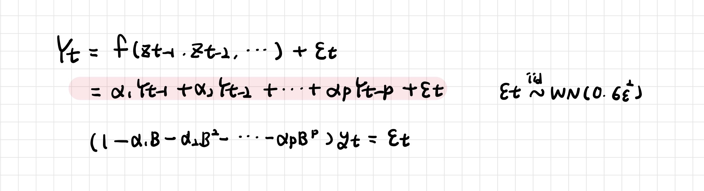
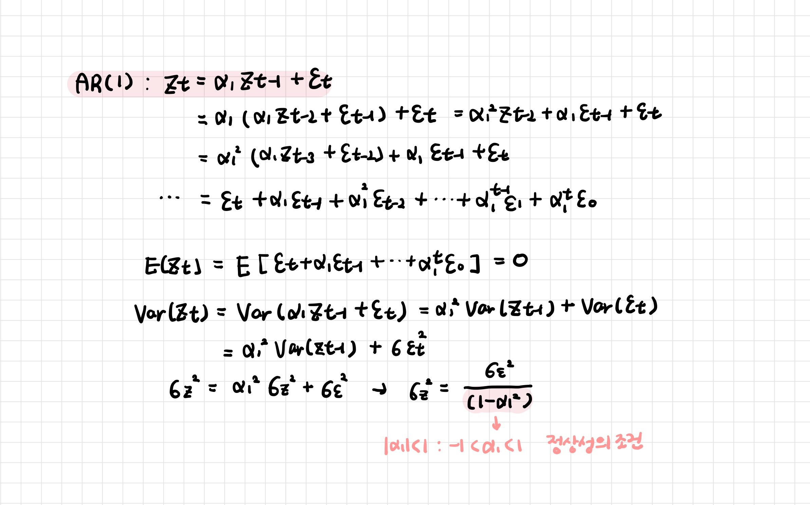
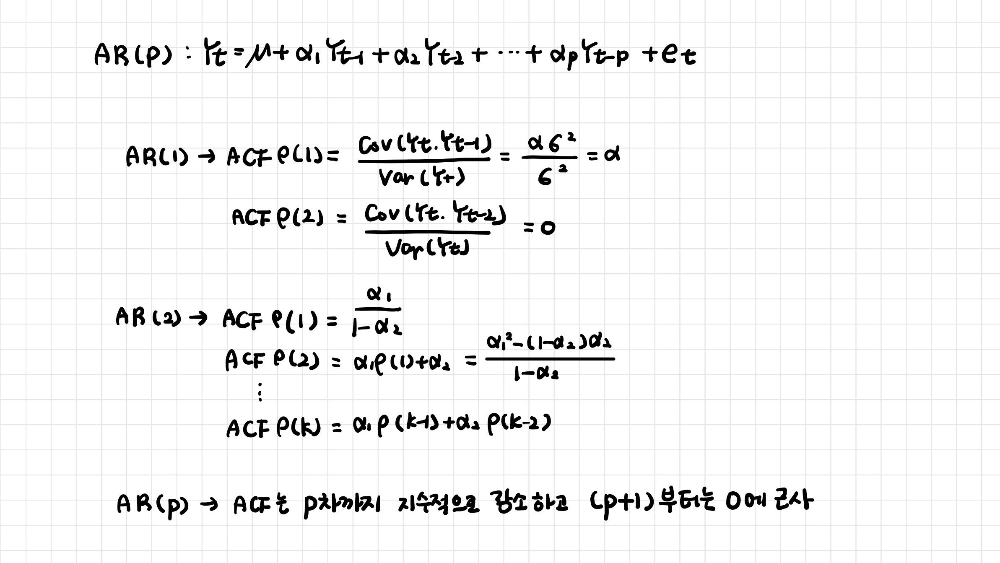
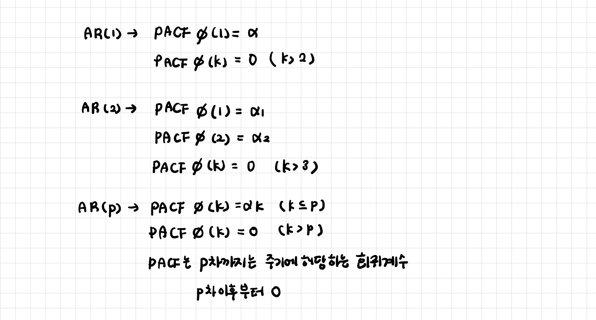
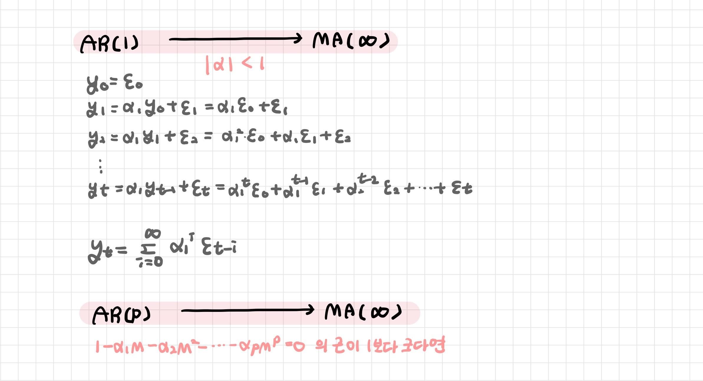

# 자기회귀 모형 AR

> Auto Regression 모형

[TOC]

**자기상관성을 시계열 모형으로 구성하여 예측하고자 하는 변수의 과거 관측값의 선형 결합으로 미래 값을 예측하는 방법**

- 시계열 데이터들 사이의 자기상관을 토대로 한 확률모형으로 분석

- 과거의 자신의 관측값이 이후 자신의 관측값에 영향을 준다

 

## 1. AR(1) 모형

 

## 2. 자기상관 검정

### 2-1. ACF

- 시차 p 까지는 시차가 증가함에 따라 지수적으로 감소

- 시차 P+1 부터는 0에 근사

### 2-2. PACF

- 시차 p+1 이상인 경우부터 0의 값을 가지는 절단형태 

 

## 3. 가역성 조건

>  Invertibility Condition

