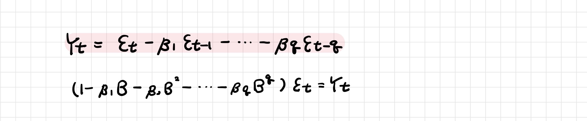
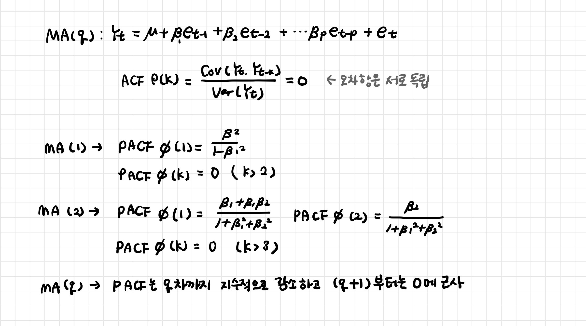

# 이동평균 모형 MA

> Moving Average 모형

[TOC]

**예측오차를 이용하여 미래를 예측하는 모형**

- 시계열 자료가 연속적인 오차항들의 영향을 받는다

 

## 1. 자기상관 검정

### 1-1. ACF

- 

### 1-2. PACF

- 시차 q 까지는 시차가 증가함에 따라 지수적으로 감소

- 시차 q+1 부터는 0에 근사

 

## 2. 가역성 조건

>  Invertibility Condition

