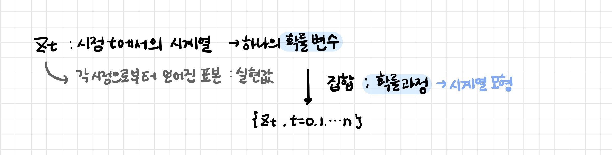
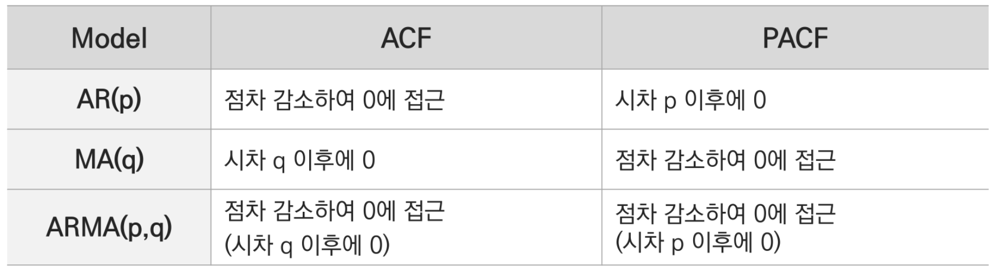

# BOX-JENKINS 방법

[TOC]

- 확률 시계열 모형을 주어진 시계열 데이터에 적합시키고 이 모형의 적합성 여부에 대해 판단하는 방법
- 확률에 기반하여 시계열을 분석하고 예측하는 방법

<br>

## 1. ARIMA 모형

> ARIMA (Auto Regression Integrated Moving Average)

**정상적 시계열에 대한 Box-Jenkins모형**

AR (시계열 데이터의 과거 관측치가 설명변수) + I (차분) + MA (과거 관측치가 설명하지 못하는 오차항이 설명변수)

````
p: 자기회귀의 차수 ▶ 시계열 데이터의 과거 관측값에 의해 설명되는 패턴
d: 차분의 횟수 ▶ 과거 관측값으로 설명하지 못하는 패턴
q:이동평균의 차수 ▶ 계절성이 있다면 주기에 의해 차분 후 모형 추정
````

- 전제: 시계열 데이터가 정상성을 만족해야한다
  - 평균과 분산이 시간에 상관없이 일정
  - 공분산이 시간에 상관없이 오직 시차에만 의존
- ARIMA 모형의 인자에 따라 자기회귀모형 (AR), 이동평균모형 (MA), 자기회귀이동평균모형 (ARMA)
- 모형 식별을 위한 Correlogram: 시차 k가 달라짐에 따라 ACF, PACF 함수값의 변화를 나타내는 것





<br>

----

<br>

## 2. BOX-JENKINS 절차

### 2-1. 사전진단

- 시간도표 진단 (추세, 계절성 여부, 정상성 진단)
- 백색잡음 검정
- 단위근 문제 진단
- 등분산 검정

<br>

### 2-2. 모형식별

주어진 시계열 데이터에 적합한 모형을 만든다

- ACF, PACF: 차수 진단 및 계절성 진단
- 통계적 검정: KPSS 검정, Ljung-Box Q 방법

<br>

### 2-3. 모형추정

후보 모형들의 최적 모수 값을 추정한다

- 계절성이 있는 경우 주기만큼 차분 후 진행

- 최소제곱법, 최대우도법으로 ARMA(p, q) 회귀계수 추정

<br>

### 2-4. 모형 진단

추정된 모형으로부터 얻어진 예측값이나 적합값, 잔차들이 적합한지를 진단하고 가장 적합한 모형을 선정한다

- 회귀계수의 유의성 진단
- 잔차진단: White Noise, No Auto Correlation

<br>

### 2-4. 미래값 예측

최종 선정한 모형을 이용해 주어진 데이터의 미래 값을 예측한다

