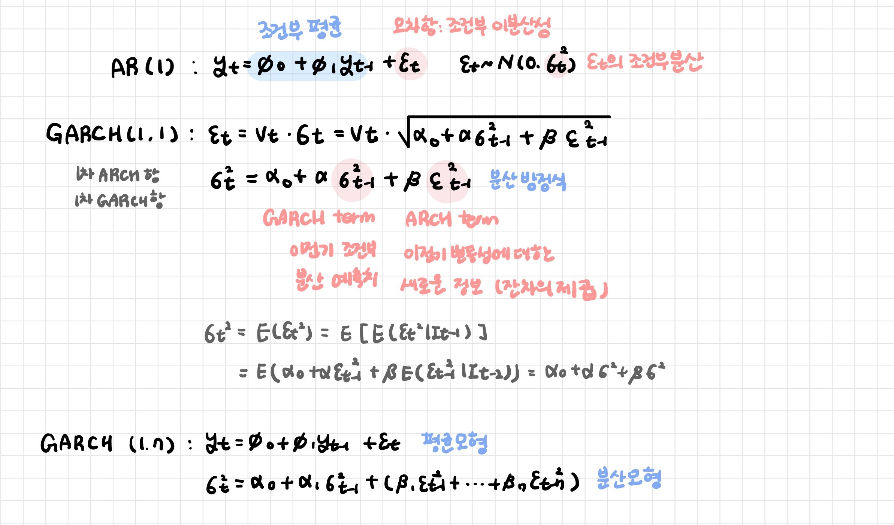
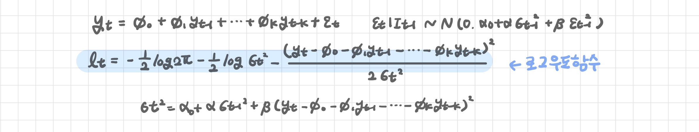

# GARCH 모형

> Generalized AutoRegressive Conditional Heteroskedastic Model: 일반화된 ARCH 모형 - Tim P. Bollerslev(1986)

**조건부 분산이 직전 오차항의 제곱값과 함께 자체 시차값에 의존하도록 하는 모형**

- ARCH모형의 문제점을 극복하기 위해 고안된 모형

- ARCH(q) => GARCH(0, q)

