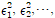
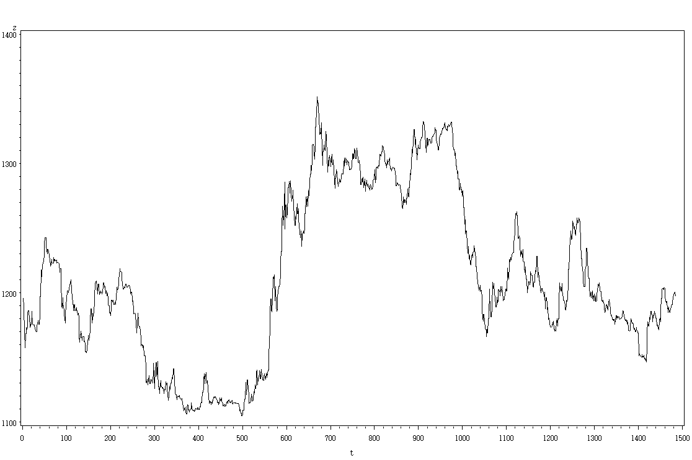
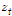
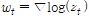
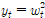
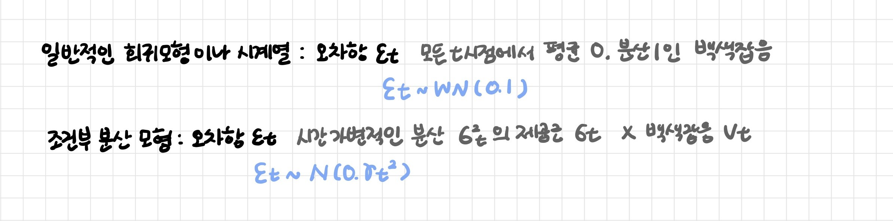

# 변동성 모형

[TOC]

## 1. 변동성

위험과 불확실성(자산 수익의 표준 편차, 분산으로 측정)

금융자산의 전체적 위험 Risk에 대한 대체적인 척도


| 전통적인 계량 분석 혹은 시계열 분석                          |
| ------------------------------------------------------------ |
| **확률변수의 (조건부) 평균값을 모형화한 것**                 |
| - 독립변수에 따른 종속변수의 평균적인 변화를 분석: 회귀 모형 또는 시계열 모형<br>- 오차항에 관한 정보는 보조적 역할만<br>- 등분산의 가정: 모든 t에 대해 분산이 일정하다 안정성 조건 |

-  실제 금융시장의 변동성은 시간에 따라 변화
  - 시계열에서는 무작위적으로 일정한 구간을 벗어난 극단값이 관측되는 경우가 많다
  - 변동성이 커진다는 것은 일반적으로 시장으로 유입되는 정보의 양이 많아지는 것
- 시간의 흐름에 따라 변화하는 분산에 대한 연구 시작
  - 자산을 보유하는데 따른 위험의 분석, 파생상품의 가치 분석 등에 있어서 변동성 중요
  - 분산의 변동성 (이분산성)을 고려함으로써 보다 정확한 추정이나 신뢰구간 구축 가능

금융시장의 변동성(위험과 불확실성)을 분석하기 위해선 금융시계열의 분산(variance)과 공분산(covariance) 등을 이용한 정교한 추정과 예측이 필요

| 실제적인 시계열 분석, 금융 시계열 분석 |
| -------------------------------------- |
| **확률변수의 조건부 분산**             |

<br>

---

<br>

## 2. 금융시계열의 특징

> 주식가격, 환율, 인플레이션율 등

### 2-1. Fat  tail

- 정규분포에 비해 꼬리부분에 위치하는 관찰값의 비중이 높다
- 이상치(Outlier)가 발생할 확률이 높다
- 첨도(Kurtosis)가 정규분포보다 큰 첨예분포(leptokurtic)
  - 관찰값들이 독립적이지 못하고 서로 일정한 의존성을 가지고 있다
  - 첨도: 확률분포의 뾰족한 정도를 나타내는 척도로, 관측치들이 중심에 몰려있는 정도

<br>

### 2-2. Volatility  clustering

> 변동 집중성 / 변동 군집 현상

**어떤 기간동안 상당한 폭의 변동성을 보이다가 상대적으로 평온한 기간이 이어지는 현상**

- 변동 폭의 변화가 어떤 경향을 가지는 것: 현재의 변동성은 직전 시기들의 변동성에 양의 상관관계(자기상관)를 보인다는 것
- 주식을 비롯한 대부분의 금융 시계열이 각종 충격(shock)에 민감하게 반응하며 그 충격이 일정 기간 시장에 영향을 미치기 때문: 한번 나타난 큰 변화는 당분간 계속 큰 변화를 유지하며, 작은 변화는 당분간 지속적으로 작은 변화를 나타낸다

```
이 때문에 금융 시계열은 오차항의 분산이 항상 일정하다는 고전적인 회귀모형 가정을 위배한다 = 시계열의 오차항에 이분산성이 발생한다
```

- **이분산성(heteroskedasticity)**: 독립변수에 따른 종속변수의 분산이 상이하거나 어떤 형태를 가지는 현상
  - 오차항의 분산이 독립변수와 함수관계에 있을 때 발생
  - OLS 방법으로 도출한 추정량은 BLUE가 될 수 없다: 추정량은 불편성(unbiased estimate)은 유지할 수 있지만 최소분산을 갖는 효율성(efficient)은 지니지 못한다
  - 기울기 계수의 표준오차를 불안정하게 만들어 가설 검정의 신뢰성 및 유효성을 저하한다

변동 집중성에 의한 변화 폭은 로그변환이나 제곱근 변환 등의 자료변환으로 상쇄되지 않으며 자료의 변화 폭 (오차의 제곱   )에 대해 적절한 시계열 모형을 적용해야한다

<br>

 

시계열 자료 

- 구간에 따라 변화의 폭이 일정하지 않다: log 변환

- 선형추세와 확률추세를 제거: 1차 차분

<br>

 

시계열 자료 

- 추세성은 대체로 제거되었다

- 자료의 변화의 폭이 부분 구간에서 큰 경우와 작은 경우가 집중되어 있는 상태
- 변동 집중성을 잘 확인하기 위해 자료를 제곱

 

시계열 자료  

<br>

---

<br>

## 3. 변동성 모형



### 3-1. AR모형

시차종속변수 y(t-p)를 독립변수로 가지므로 계열 상관성 문제와 이분산성의 문제가 동시에 발생할 수 있다

**계열상관성 (자기상관성): 오차항끼리 상관성**

- 미래의 종속변수 값을 예측할 때 모든 기울기 계수와 종속변수의 추정치를 이용하므로 계열 상관성의 문제 발생 가능

**이분산성: 오차항의 분산끼리 상관성**

- t기의 오차항의 분산이 t-1기의 오차항의 분산과 상관성이 있다면 이분산성 문제 발생

<br>

### 3-2. (G)ARCH 모형

**금융시계열의 변동성을 추정할 때 가장 폭넓게 사용되는 모형으로 확률변수의 조건부 분산이나 변동성을 모형화한 것**

```
시간에 따라 가변적인 조건부 분산을 다룬다: 분산이 장기적으로 평균 회귀한다는 가정
```

- (G)ARCH 모형의 추정: 오차항의 조건부 정규분포 가정하에 최우추정법에 의해 추정
  - ARCH: 추정치가 수렴하지 않을수도 있고 변동성의 자기회귀계수가 음수인 경우도 발생
  - GARCH: 긍정적인 쇼크와 부정적인 쇼크에 대한 비대칭적 효과에 대해서도 모델링 가능

<br>

**ARCH 모형**

```
이분산성 가정: 오차항의 분산은 과거 오차항의 제곱값에 의존하여 시간의 경과에 따라 변화한다
```

- 특정시점 t의 오차의 분산은 과거의 t-1 오차항의 제곱에 의해 설명할 수 있다
- 평균방정식(ARIMA, Regression)과 분산방정식(ARCH)에 대해 동시적인 추정을 하는 ARCH 모형 등장

<br>

**GARCH 모형**

```
시차 변수 포함: 분산 방정식에 분산항의 시차 변수를 포함한다
```

- ARCH(p) 모형 추정에 있어 p의 차수가 커지게 되면 추정 계산의 복잡성 증가

- 분산 방정식에 분산항의 시차 변수를 포함시키는 방법으로 일반화된 자기회귀조건부 이분산 모델 GARCH(p, q) 등장

<br>

**다양한 변동성 모형들**

- Historical Volatility: 과거 변동성의 단순 평균을 통해 변동성 예측치 추정
- Exponential Weighted Moving Average Model: 지수적 가중치를 준 이동평균을 통해 예측치 추정
- Autoregressive Volatility: 변동성에 대한 ARMA 모형을 추정하여 예측치 추정