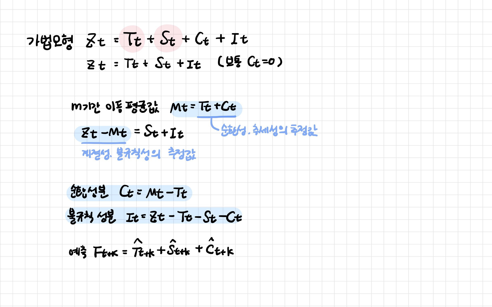

# 시계열 분해

> Decomposition

[TOC]

**시계열의 기본 패턴 (변동 요인)을 개별 성분 (추세성, 계절성, 순환성, 불규칙성)으로 분해하여 시계열의 특징을 분석하고 분해된 각 성분을 개별적으로 예측한 후 이를 다시 결합시켜서 예측하는 방법**

- 시계열에 영향을 주는 일반적인 요인을 시계열에서 분리하여 분석하는 방법

- 시계열의 구성요소를 추세요인, 계절요인, 순환요인, 불규칙요인으로 구분하여 각 요소로 분해하여 분석: 추세, 계절, 순환 요인을 제거한다면 남은 자료는 우연변동에 의한 정상 시계열

 

## 1. 가법 모형 

> Additive Model

요소들이 합쳐진 시계열 데이터

- 계절성의 진폭이 일정한 수준일 때 주로 사용

- 계절성과 불규칙성을 제거: 시계열의 m기간 중심이동평균을 빼주기

- 추세성과 계절성이 별개

 

## 2. 승법 모형

Multiplicative Model

요소들이 곱해진 시계열 데이터

- 계절성의 진폭이 시계열의 수준에 따라 달라질 때 주로 사용
- 계절성과 불규칙성을 제거: 시계열의 m기간 중심이동평균을 빼주기

- 승법 모형에 로그를 취하면 로그가법모형

- 추세성에 따라 계절성이 변화