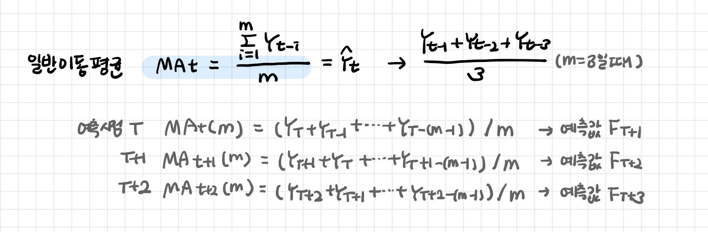
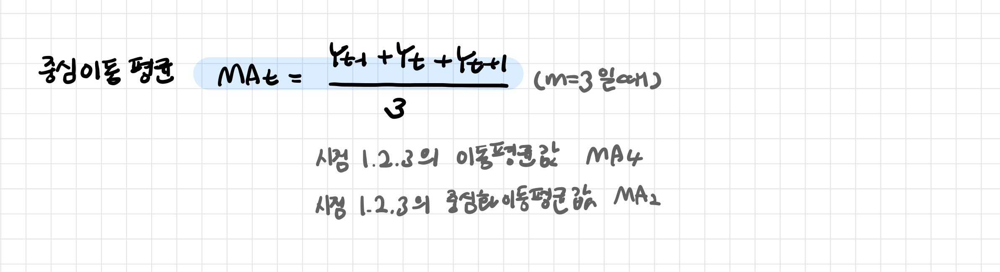

# 이동평균법

> Moving Average

[TOC]

**과거의 몇 개 관측치를 평균하여 전반적인 추세를 파악하고 예측하는 방법**

- 시계열 데이터는 주기나 불규칙성을 가지고 있다

- 과거치의 평균으로 미래 값을 예측하는 방법: 지엽적인 변동 (계절성, 불규칙성)을 제거하여 장기적인 추세를 쉽게 파악 가능 
- **주기 m**: 주기의 배수를 활용

- 과거치에 적용되는 가중치는 동일하다: 1/m

 

## 1. 일반이동평균

m개의 과거치 평균

 

## 2. 중심이동평균

m의 중앙시점을 사용한다

- 시계열 자료의 평균값을 다음 시점의 예측값으로 하면 추세나 계절효과 나타내기 어렵다

- 중심화이동평균방법으로 시계열 자료들의 요소를 파악할 수 있게 한다

