# 지수평활법

> Exponential Smoothing Method

[TOC]

**현재 시점의 데이터에 더 큰 가중치를 주고 과거로 갈수록 가중치를 지수적으로 감소시키면서  시계열을 예측하는 방법**

- 시계열 데이터는 시간의 흐름에 따라 데이터의 변화가 일어나 기존모형이 잘 맞지 않을 수 있다
- 오래된 과거 데이터와 최근의 데이터에 동일한 가중치를 두어 예측하기 보다는 오래될수록 낮은 가중치, 최근일수록 높은 가중치를 두어 최근의 경향성을 잘 반영하고자 하는 방법

 

## 1. 단순지수평활법

> Simple Exponential Smoothing Method

**시계열 데이터에 추세와 계절성이 없는 경우 (주기만 있는 경우)**

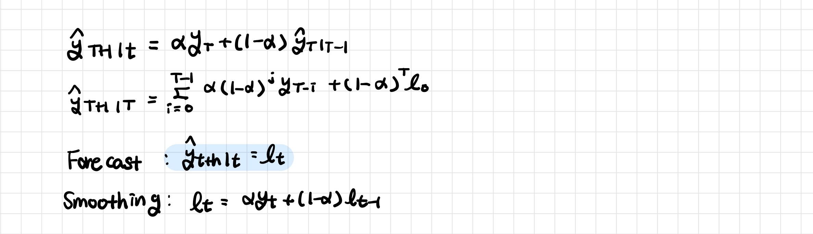

- 단순지수평활 통계량을 이용해 다음 시차의 자료를 예측

- 초기 평활값 선택
  - 시계열 수준 변화가 크다면: 첫 시점의 관측값
  - 시계열 수준 변화가 작다면: 표본평균

- 가중치 w 선택
  - 가중치가 작으면: 평활의 효과가 커진다 → 예측값은 시계열의 지엽적 변화에 둔감하게 반응
  - 가중치가 크다면: 평화릐 효과가 작아진다 → 예측값은 시계열의 지엽적 변화에 민감하게 반응

 

---

 

## 2. 이중지수평활법

> Double Exponential Smoothing Method; Holt Method

**시계열이 선형 추세에 따라 증가하거나 감소하는 경우**

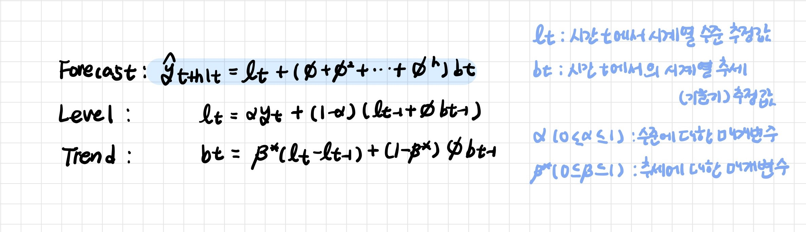

- 단순지수평활 통계량을 모형 예측에 사용하면 Bias가 발생한다

- 단순지수평활 통계량에 단순지수평활을 적용하여 통계량을 얻는 방법

 

---

 

## 3. 계절지수평활법

> Holt-Winter 계절지수평활법

계절성이 있는 시계열 데이터를 예측하는 방법

- 변동분해법과 관련이 있다
- 각 성분을 평활법으로 추정하고 시계열 값 예측

- 1개의 예측모형과 3개의 평활모형으로 구성

**가법모형 **: 계절성이 존재하고 시계열 변동 폭이 시간의 흐름에 따라 변동이 없는 경우

**승법모형** : 계절성이 존재하고 시계열 변동 폭이 시간의 흐름에 따라 변동의 폭이 커지는 경우

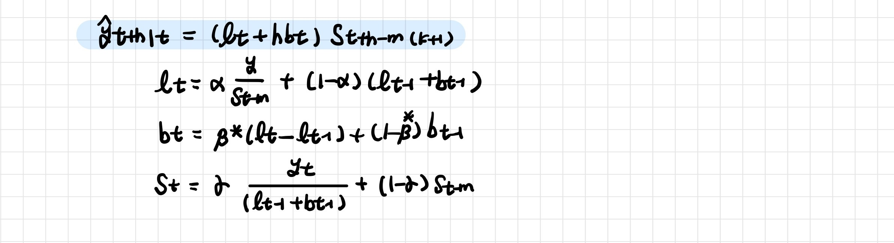

 

---

 

## 참고내용

**단순지수평활법**

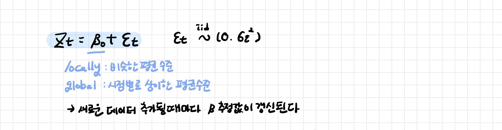

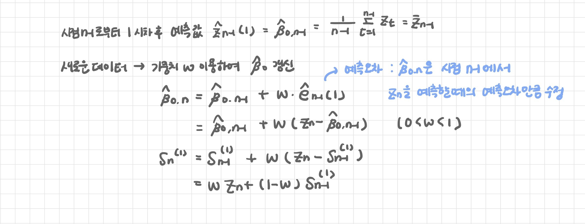

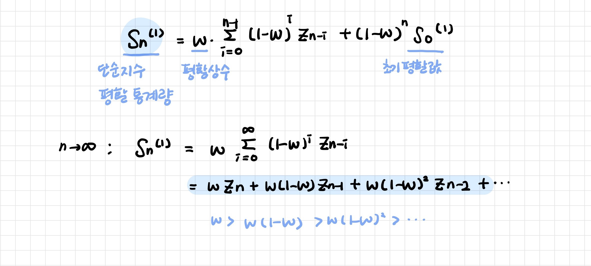

 

**이중지수평활법**

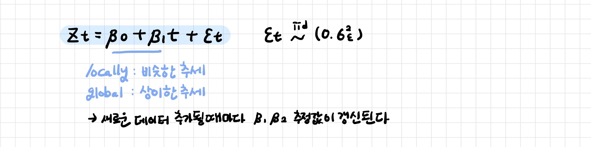

단순지수평활 통계량을 모형 예측에 사용하면 Bias가 발생한다

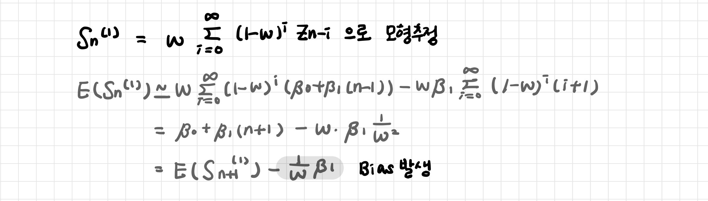

단순지수평활 통계량에 단순지수평활을 적용하여 통계량을  얻기

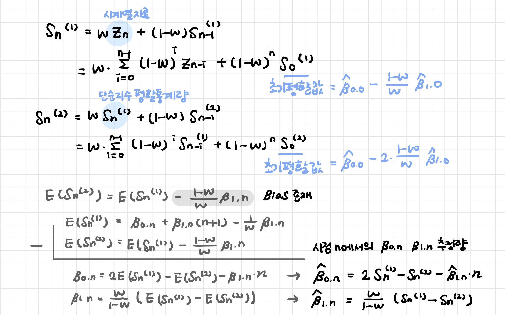

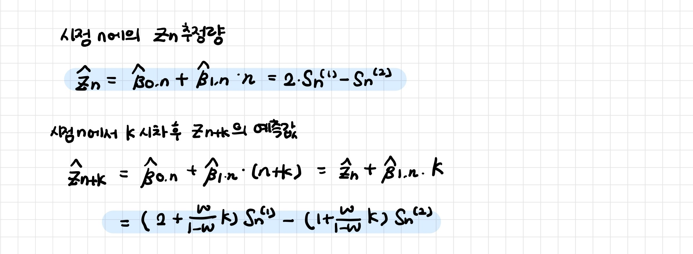

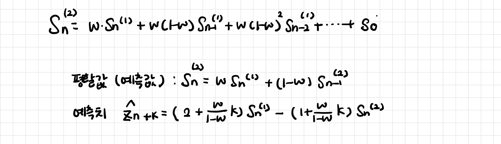
